# PANDA Collaborator Action Test Spec

Status: Draft for implementation
Owner: Codex
Target app: PANDA Collaborator, also called PC

## Goal

Prove, in a controlled fake workspace, that PC can safely manage a two-user handoff from start to finish.

In plain terms: we need a big obvious TEST mode, fake people, fake accounts, fake folders, and a fake Git repository. Then we run PC through the same steps a real shared workstation would use. The test only passes if PC handles setup, scanning, user switching, session start, messages, handoff creation, package review, and safety behavior without confusion, layout breakage, or data loss.

## Recommendation

Build a dedicated TEST MODE inside PC.

TEST MODE should not be a hidden developer trick. It should be a large visible button in the app header or top workflow area.

Phase 1 must be local-only. It must not create a GitHub repo, push to a remote, or perform any external side effect. GitHub testing is a later Phase 2 and requires a separate explicit user approval at action time.

Recommended label:

```text
TEST MODE
```

Recommended visual behavior:

```text
Normal PC theme -> Alert test theme
Dark navy/cyan   -> Black + warning yellow + test magenta accents
```

The goal is that nobody can mistake test mode for real work.

## Test Mode Button

Add one big button:

```text
[ TEST MODE ]
```

When inactive:

```text
TEST MODE
gray/dim button
```

When active:

```text
TEST MODE ACTIVE
warning yellow button
magenta border
black/yellow page accents
```

When the action test is running:

```text
TEST RUNNING
warning yellow button
pulsing or high-contrast border
```

When the action test passes:

```text
TEST PASS
green button
green banner
plain-language summary of what passed
```

When the action test fails:

```text
TEST FAIL
red button
red banner
first failing checkpoint shown in plain language
link or button to the evidence report
```

TEST MODE must show a persistent banner:

```text
TEST MODE ACTIVE - FAKE USERS, FAKE ACCOUNTS, FAKE REPOSITORY
```

The banner should stay visible during every screen: registration, hub, scan, session, handoff, packages, and messages.

## Quit Test Mode

TEST MODE must have an obvious quit control:

```text
[ QUIT TEST MODE ]
```

Recommended placement:

```text
Next to the TEST MODE button and inside the persistent TEST MODE banner.
```

QUIT TEST MODE must restore PC to normal operating state:

```text
Active app mode: normal PC mode
User 1 name: Darrin
User 2 name: Pam
Active user: whichever normal user was active before TEST MODE, defaulting to Darrin if unknown
Normal color scheme: restored
Working Tree path: restored to the pre-test normal path
Project Files Tracker path: restored to the pre-test normal path
Status banner: no TEST MODE banner
Test-only messages: hidden from the normal status stream unless viewing test evidence
```

QUIT TEST MODE must not delete test evidence automatically. Evidence stays available under the test sandbox so the result can be inspected later.

QUIT TEST MODE must remain available while a test is running. If the user quits mid-run, PC must safely stop the test runner, write a `TEST ABORTED` evidence report, restore normal state, and then run the normal-mode sanity check.

Pass condition:

```text
After quitting TEST MODE, the visible app returns to Darrin and Pam, the alert test colors are gone, and no Bob/Karen test identity remains in normal app controls.
```

Fail condition:

```text
Bob or Karen remains visible in normal mode.
The app stays in the alert test color scheme.
The fake repo remains selected as the normal Working Tree path.
The user cannot exit TEST MODE after a failed test.
```

## State Snapshot and Restore

Before TEST MODE changes visible users, paths, settings, theme state, or active user, PC must capture a normal-state snapshot.

Preferred implementation:

```text
Use a separate temporary TEST settings file.
```

Fallback implementation:

```text
Snapshot the normal settings file before touching it.
Restore that snapshot on QUIT TEST MODE, TEST ABORTED, or app recovery after a crash.
```

The snapshot must include enough information to restore:

```text
Darrin/Pam profile names
active normal user
normal Working Tree path
normal Project Files Tracker path
normal theme/user color state
normal setup completion state
normal account labels and tool paths
```

Real snapshot values must not be copied into test evidence. Evidence may only record redacted restore status:

```text
normal_state_snapshot: captured
normal_state_restored: true
real_values_redacted: true
```

If PC starts and detects an unfinished TEST MODE session, it must offer recovery:

```text
Restore normal Darrin/Pam state
Open test evidence
Continue TEST MODE
```

Recommended default is `Restore normal Darrin/Pam state`.

## Normal-Mode Sanity Check

After quitting TEST MODE, PC must run a final normal-mode sanity check.

The check must confirm:

```text
Darrin is visible as normal User 1.
Pam is visible as normal User 2.
Normal color scheme is active.
TEST MODE banner is gone.
Fake repo is not selected as the normal Working Tree path.
Fake Project Files Tracker path is not selected as the normal tracker path.
Normal settings are intact.
Bob/Karen do not remain in normal controls.
```

If this sanity check fails, PC must show a red restore warning and keep the evidence report available.

## Test Personas

Change the test user names to:

```text
User 1: Bob
User 2: Karen
```

Bob and Karen must appear everywhere the real users would appear:

- active user banner
- registration cards
- workflow panels
- handoff controls
- package metadata
- messages
- saved settings
- generated handoff files

Pass condition:

```text
There are no leftover Darrin, Adam, User 1 placeholder, or User 2 placeholder names in active TEST MODE screens or generated TEST MODE artifacts.
```

Entering TEST MODE immediately switches the visible app users to Bob and Karen. The app must not wait until `Run Test` to show the fake identities. QUIT TEST MODE restores Darrin and Pam.

## Fake Credentials

Use fake labels only. Do not use real passwords, tokens, API keys, OAuth keys, or recovery codes.

Recommended fake account labels:

```text
Bob Codex account:   test-bob-codex@example.invalid
Bob Claude account:  test-bob-claude@example.invalid
Karen Codex account: test-karen-codex@example.invalid
Karen Claude account:test-karen-claude@example.invalid
```

Recommended fake Git identities:

```text
Bob Git name:   Bob Test
Bob Git email:  bob.test@example.invalid
Karen Git name: Karen Test
Karen Git email:karen.test@example.invalid
```

Pass condition:

```text
PC stores and displays only these fake labels. It never asks for or stores secrets.
```

## Fake Local Test Folders

Recommended local root:

```text
C:\CODEX PG\CODEX PANDA Collaborator\PANDA test sandboxes\pc-action-test
```

Recommended folder layout:

```text
pc-action-test
  fake-project-files-tracker
    skills\pg-project-sync\MANIFEST.md
    workflows\project_knowledge_sync_2026-05-01\README.md
  fake-repo
    README.md
    docs\handoff-notes.md
    src\sample.txt
  fake-claude
    Claude Desktop Fake.exe
    Claude Code Fake.cmd
  evidence
    screenshots
    reports
```

The fake repo must be a real Git repository, but it must contain only fake files.

The fake Claude Desktop and Claude Code paths must be inert placeholder files only. PC must never execute those files during the test.

Pass condition:

```text
PC can browse to and scan fake-repo, and PC can point Project Files Tracker at fake-project-files-tracker.
```

## Phase 2 Fake GitHub Test Repo

Phase 1 is local-only and must not create or use a GitHub repo.

Phase 2 may add a fake GitHub test repo only after separate explicit user approval.

Recommended Phase 2 GitHub repo name:

```text
pc-action-test-sandbox
```

Recommended Phase 2 repo purpose:

```text
A disposable fake repository used only to prove PC can scan Git state and preserve handoff evidence.
```

Recommended first files:

```text
README.md
docs/test-plan.md
src/sample.txt
```

Important Phase 2 safety rules:

```text
Do not use a real production repository for PC acceptance testing.
Do not create a repo without explicit user approval at action time.
Do not push to a remote during Phase 1.
Define owner, visibility, cleanup plan, and naming collision behavior before creation.
```

Phase 2 pass condition:

```text
The GitHub repo exists only after approval, has a clean initial commit, can be cloned locally into fake-repo, and PC never touches any non-test repo during TEST MODE.
```

## Test Data States

The fake repo should be tested in these Git states:

```text
Clean tree
Untracked file
Modified file
Staged file
Deleted file
Mixed dirty tree
Conflict
```

Recommended fake file changes:

```text
Untracked: notes\bob-new-note.md
Modified:  docs\handoff-notes.md
Staged:    src\sample.txt
Deleted:   docs\old-note.md
Conflict:  docs\conflict-note.md
```

`docs\old-note.md` must exist in the initial fake repo before the deleted-file checkpoint.

The conflict checkpoint is separate and runs after the normal clean/dirty handoff path passes. PC must detect and report the conflict clearly. PC must not attempt to resolve the conflict.

Pass condition:

```text
Working Tree counts match Git reality for staged, unstaged, untracked, deleted, and conflicted files.
```

## Test Flow Diagram

```mermaid
flowchart LR
  A["Turn on TEST MODE"] --> B["Create fake folders and fake repo"]
  B --> C["Register Bob and Karen"]
  C --> D["Scan Working Tree"]
  D --> E["Start Session"]
  E --> F["Switch Bob/Karen"]
  F --> G["Save Messages"]
  G --> H["Create Safe Handoff"]
  H --> I["Inspect Package"]
  I --> J["Run conflict detection checkpoint"]
  J --> K["Collect evidence"]
  K --> L{"Pass?"}
  L -->|Yes| M["TEST PASS button turns green"]
  L -->|No| N["TEST FAIL button turns red"]
  M --> O["Write final evidence report"]
  N --> O["Write final evidence report"]
  O --> P["Quit TEST MODE"]
  P --> Q["Restore Darrin and Pam"]
  Q --> R["Run normal-mode sanity check"]
```



## Required Test Steps

### Step 1: Enter TEST MODE

Action:

```text
Click TEST MODE.
```

Expected result:

```text
The app changes to the alert test color scheme.
The test banner appears.
The app clearly says fake users, fake accounts, fake repository.
The visible users immediately change to Bob and Karen.
The normal state snapshot is captured before the visible switch.
```

Fail if:

```text
The app still looks like normal mode.
The test banner disappears.
Any real user/account/repo is silently reused.
```

### Step 2: Generate Test Sandbox

Action:

```text
Click Create Test Sandbox.
```

Expected result:

```text
PC creates the fake local folders.
PC creates the local fake Git repo.
PC writes fake test files.
PC records where everything was created.
PC creates a fresh timestamped run folder and does not overwrite old runs.
```

Fail if:

```text
Any file is created outside the approved test sandbox.
Any real repo path is modified.
An older run folder is overwritten.
```

### Step 3: Register Bob and Karen

Action:

```text
Open setup.
Confirm Bob on the left.
Confirm Karen on the right.
Save Bob.
Save Karen.
Open hub.
```

Expected result:

```text
Bob and Karen are side by side.
Both users use fake account labels.
Both users point to the fake repo.
Both users have fake Claude paths.
Both users have fake Git identity.
```

Fail if:

```text
The app jumps to a surprise screen.
User 2 cannot register after User 1.
Names or colors disagree between cards, header, and hub.
```

### Step 4: Scan Working Tree

Action:

```text
Click Scan repository.
```

Expected result:

```text
The Working Tree panel updates branch and file counts.
Browse, Scan repository, and Packages do not touch or overlap.
Escape clears focus and recovers the panel.
No weird bottom divider or horizontal scrollbar appears.
Working Tree is locked to the current run's fake repo.
```

Fail if:

```text
The scan button traps focus.
Escape does nothing.
The panel layout shifts into broken controls.
The scan opens setup unexpectedly.
Browse or Scan can drift into a real repo during TEST MODE.
```

### Step 5: Start Session

Action:

```text
Click Start Session.
```

Expected result:

```text
PC confirms session start.
PC keeps the fake active user visible.
PC refuses unsafe actions if setup is incomplete.
```

Fail if:

```text
Session starts without both users registered.
PC loses the active user.
PC points to a non-test repo.
```

### Step 6: Switch Users

Action:

```text
Switch from Bob to Karen.
Switch from Karen to Bob.
```

Expected result:

```text
Header updates.
Workflow panels update.
Active user colors update.
Fake account context updates.
Repo remains the shared fake repo.
```

Fail if:

```text
Names, colors, or account labels disagree.
Switching users changes to a real repo.
```

### Step 7: Save Messages

Action:

```text
Save one Bob message.
Save one Karen message.
Save one concern.
Save one achievement.
```

Expected result:

```text
Messages appear in the app.
Messages are saved to local project history.
Messages include fake user context.
```

Fail if:

```text
Messages disappear after reload.
Messages are attributed to the wrong user.
Messages include real account data.
```

### Step 8: Create Safe Handoff

Action:

```text
Click Create Safe Handoff.
```

Expected result:

```text
PC creates a handoff package.
PC records branch, HEAD, dirty files, copied files, skipped files, and active fake user.
PC does not run destructive Git commands.
```

Fail if:

```text
No handoff package appears.
The package lacks repo state.
The package uses real user names/accounts.
PC modifies files outside the fake sandbox.
```

### Step 9: Inspect Package

Action:

```text
Click Packages.
Inspect the newest package.
```

Expected result:

```text
The package appears.
The package can be inspected.
The preview matches the handoff that was just created.
```

Fail if:

```text
Packages is empty after handoff.
Inspect package is dead.
The package points at the wrong repo.
```

### Step 10: Produce Evidence Report

Action:

```text
Collect test evidence.
```

Expected result:

```text
PC collects evidence under the current run's evidence folder.
PC records screenshots, repo path, branch, HEAD, users, messages, package path, and safety checks.
PC does not write the final report until PASS/FAIL/ABORTED status is known.
```

Fail if:

```text
The report is missing evidence.
The report cannot prove which repo/user/session was tested.
```

### Step 11: Show Final Test Result

Action:

```text
Finish the action test.
```

Expected result on pass:

```text
The TEST button changes to TEST PASS.
The button and banner turn green.
The result summary says the fake Bob/Karen workflow passed.
The evidence report path is visible.
Clicking TEST PASS opens the evidence report.
RUN TEST AGAIN is a separate button.
```

Expected result on fail:

```text
The TEST button changes to TEST FAIL.
The button and banner turn red.
The first failing checkpoint is visible in plain language.
The evidence report path is visible.
QUIT TEST MODE remains available.
Clicking TEST FAIL opens the evidence report.
RUN TEST AGAIN is a separate button.
```

Fail if:

```text
The user cannot tell whether the test passed or failed.
The button stays yellow after the test finishes.
The failure details are buried or too technical.
Clicking TEST PASS or TEST FAIL accidentally reruns the test.
```

### Step 12: Quit Test Mode

Action:

```text
Click QUIT TEST MODE.
```

Expected result:

```text
PC returns to normal mode.
Darrin and Pam are restored as the normal users.
The normal color scheme returns.
The normal Working Tree and Project Files Tracker paths are restored.
The TEST MODE banner disappears.
The test evidence remains saved.
The normal-mode sanity check passes.
```

Fail if:

```text
Bob or Karen remains visible in normal controls.
The fake repo remains selected as the normal repo.
The app still uses alert test colors.
The test evidence is deleted without an explicit separate delete action.
The normal-mode sanity check is skipped.
```

## Test Run Folder Rules

Each TEST MODE run must create a fresh timestamped run folder.

Recommended shape:

```text
PANDA test sandboxes\pc-action-test\runs\YYYY-MM-DD_HHMMSS
```

Each run folder owns:

```text
fake-project-files-tracker
fake-repo
fake-claude
evidence\screenshots
evidence\reports
run-state.json
```

PC must not automatically overwrite or delete previous run folders. Successful PASS runs stay saved. Failed and aborted runs also stay saved.

Cleanup is a separate future manual control and is not part of Phase 1 unless explicitly implemented with confirmation.

Implemented Phase 1 sandbox contract:

```text
Backend endpoint: POST /api/test/sandbox
Backend function: create_test_sandbox()
Default root: C:\CODEX PG\CODEX PANDA Collaborator\PANDA test sandboxes\pc-action-test
Run folder shape: runs\YYYY-MM-DD_HHMMSS, with _01, _02 suffixes if needed
UI control: Create Sandbox, visible only inside TEST MODE
```

The endpoint must return the generated paths and the initial fake repo status. It must set:

```text
external_side_effects: false
github_repo_created: false
git_remote_configured: false
destructive_git_commands_run: false
```

The fake repo must start with:

```text
at least one staged change
at least one unstaged modified file
at least one untracked file
at least one deleted file
zero conflicted files at sandbox creation
docs\conflict-note.md reserved for a later explicit conflict checkpoint
```

## Test Checklist UX

TEST MODE must show a visible step-by-step checklist.

Each checkpoint can have one status:

```text
Pending
Running
Pass
Fail
Aborted
```

The checklist must update as the test runs. On failure, the failed checkpoint stays visible and the first failure is shown in plain language.

## Locked Test Paths

During TEST MODE, PC must lock Working Tree and Project Files Tracker paths to the current run's fake paths.

Normal Browse controls must not allow selection of a real repo during TEST MODE.

If a path change is needed during TEST MODE, it must use a test-only control that remains inside the current run folder.

## Evidence Report Schema

Every PASS, FAIL, and ABORTED run must write an immutable evidence report.

Recommended report files:

```text
evidence\reports\PC_TEST_REPORT_YYYY-MM-DD_HHMMSS.md
evidence\reports\PC_TEST_REPORT_YYYY-MM-DD_HHMMSS.json
```

Required fields:

```text
run_id
started_at
finished_at
result: PASS | FAIL | ABORTED
phase: local-only
test_mode_theme_seen: true | false
users: Bob, Karen
fake_repo_path
fake_project_files_tracker_path
branch
head_sha
git_counts_by_checkpoint
messages_created
handoff_package_path
screenshots
first_failure_plain_language
normal_state_snapshot: captured | missing
normal_state_restored: true | false | not_attempted
real_values_redacted: true
destructive_git_commands_run: false
external_side_effects: false
```

Reports must not include real Darrin/Pam account labels, real normal paths, real tokens, or real credentials.

## Required Applets

PC needs applets that act like inspectors. These applets should fail loudly when the UI or workflow is broken.

Required applets:

```text
CODEX_ui_identity_applet.py
Checks names, colors, user identity, and registration layout.

CODEX_ui_layout_applet.py
Checks Working Tree spacing, overflow, and Escape recovery.

CODEX_pc_action_test_applet.py
Runs the full Bob/Karen fake-workspace test.
```

Implemented Phase 1 runner contract:

```text
Backend endpoint: POST /api/test/run
Evidence endpoint: GET /api/test/evidence?path=<report path>
Backend function: run_pc_action_test()
Inspector applet: CODEX_pc_action_test_applet.py
UI control: Run Test / Run Test Again
```

The runner must create a fresh sandbox, redirect package/history output into that run folder, scan the fake repo, start a Bob session, save Bob/Karen messages, create and inspect a handoff package, run the non-destructive conflict checkpoint, write evidence, and return PASS or FAIL.

Clicking TEST PASS or TEST FAIL must open the saved evidence report in the Status Messages panel.

## New Action Test Applet Design

Create:

```text
CODEX_pc_action_test_applet.py
```

The applet should:

```text
1. Create a fresh timestamped run folder under the fake test sandbox.
2. Create fake Project Files Tracker folders.
3. Create fake Claude paths.
4. Create the local fake Git repo.
5. Write fake files and fake Git states.
6. Start PC or call the local PC API.
7. Register Bob and Karen.
8. Scan the repo.
9. Start session.
10. Switch users.
11. Save messages.
12. Create handoff.
13. Inspect package.
14. Run the separate conflict-detection checkpoint.
15. Collect evidence.
16. Evaluate PASS/FAIL.
17. Write final evidence.
18. Print PASS/FAIL/ABORTED with exact reasons.
```

The applet must never delete or alter anything outside the current timestamped run folder:

```text
C:\CODEX PG\CODEX PANDA Collaborator\PANDA test sandboxes\pc-action-test\runs\YYYY-MM-DD_HHMMSS
```

## Conclusive Pass Standard

PC is accepted only when all of these are true:

```text
Unit tests pass.
Identity applet passes.
Layout applet passes.
Action test applet passes.
Live browser smoke test passes.
Evidence report exists.
No real repo, account, or user data was used.
Only redacted normal-state restore status appears in evidence.
No destructive Git command was run.
No external side effect was performed.
Generated handoff package matches the fake repo state.
Bob and Karen identities remain correct throughout.
Working Tree stayed locked to the fake repo during TEST MODE.
The conflict checkpoint detects a conflict and does not resolve it.
TEST PASS turns the button and banner green.
TEST FAIL turns the button and banner red.
TEST PASS and TEST FAIL open the evidence report when clicked.
RUN TEST AGAIN is a separate control.
QUIT TEST MODE restores normal Darrin and Pam state.
QUIT TEST MODE works after both pass and fail.
QUIT TEST MODE works during a running test and writes TEST ABORTED.
Normal-mode sanity check passes after quit.
```

## Final Acceptance Command Set

Recommended verification commands:

```powershell
python -m unittest -v tests.test_panda_collaborator
python CODEX_ui_identity_applet.py
python CODEX_ui_layout_applet.py
python CODEX_pc_action_test_applet.py
```

Recommended manual browser checks:

```text
1. Open PC.
2. Turn on TEST MODE.
3. Confirm alert color scheme.
4. Confirm Bob and Karen.
5. Scan fake repo.
6. Press Escape.
7. Switch users.
8. Create handoff.
9. Inspect package.
10. Confirm the conflict checkpoint reports a conflict without resolving it.
11. Confirm TEST PASS turns green or TEST FAIL turns red.
12. Click TEST PASS or TEST FAIL and confirm the evidence report opens.
13. Quit TEST MODE.
14. Confirm Darrin and Pam are restored.
15. Confirm normal-mode sanity check passed.
```
