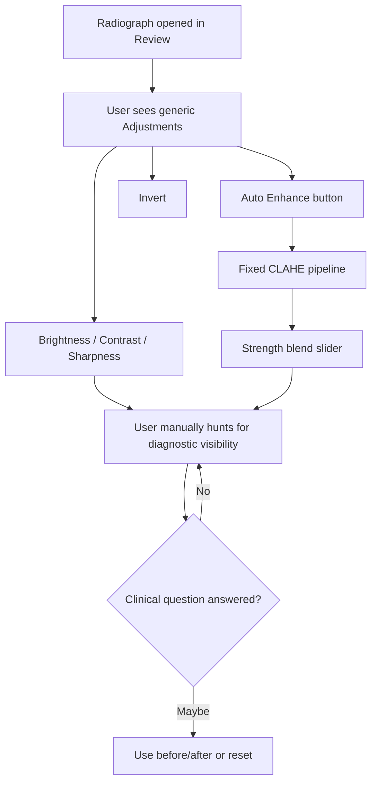
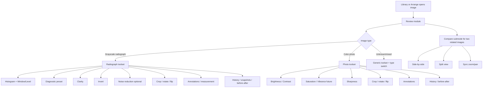
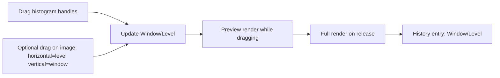
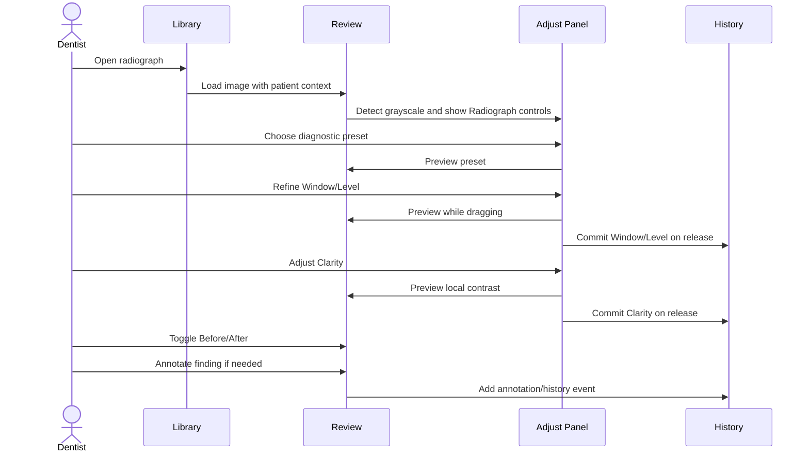
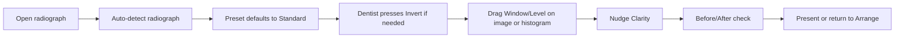

# Review Module Radiograph UX Spec v1

Created: 2026-04-25  
Owner: Codex  
Scope: Review UX for single-image work and Compare submode, with radiograph enhancement as the primary clinical toolset.

## Executive Position

The Review module should not present radiographs as generic photos with a few grayscale toggles. Dental radiographs need a radiology-style enhancement workflow:

- Window / Level for grayscale tone control.
- Task presets for common diagnostic reads.
- Clarity for multi-scale local contrast, not blunt CLAHE strength.
- Invert, crop, rotate/flip, before/after, history, and annotations as first-class clinical tools.
- Optional noise reduction after the core tone/clarity system is right.

Current production has a useful foundation: histogram, Auto Enhance, Strength, brightness, contrast, saturation, sharpness, invert, transform controls, crop, history, and adaptive radiograph/photo sections. But the current Auto Enhance model is too coarse for clinical radiograph review. The v4 UX should replace "make it better" with a small, clinically named toolkit that lets a dentist answer a specific diagnostic question quickly.

## Module Naming Lock

Darrin has locked the v4.0 module set as **Library / Arrange / Review / Present**. The earlier Edit vocabulary is now conceptually renamed to **Review**. Compare is not a top-level module; it is a submode inside Review.

Reference mockups remain file-named from the earlier vocabulary:

- `v4_0_edit_image_mockup.html` is the Review module visual target.
- `v4_0_comparison_mockup.html` is the Review > Compare submode visual target.

This document keeps the historical filename for continuity but uses **Review** as the canonical module name.

## Current Implementation Snapshot

Current files:

| File | Relevant current behavior |
|---|---|
| `panels.py` | `AdjustmentsPanel`, histogram, Auto Enhance, Strength, sliders, invert, transform, crop controls |
| `adjustments.py` | `EditState` with brightness, contrast, saturation, sharpness, invert, rotation, flips, crop |
| `canvas.py` | render/apply pipeline, before/after, tools, panning/zooming |
| `history.py` | undo history and snapshots panel |
| `annotations.py` | brush, text, rectangle, ellipse, arrow, crop overlay |

Current radiograph-relevant controls:

- Histogram.
- Auto Enhance button.
- Strength slider, enabled only after Auto Enhance.
- Brightness.
- Contrast.
- Saturation disabled for grayscale.
- Sharpness.
- Rotate 90 clockwise / counter-clockwise.
- Flip horizontal / vertical.
- Invert (radiograph).
- Radiograph section showing "Auto-detected grayscale image."
- Crop apply/cancel when crop tool active.
- Reset All and Reset to Original.

Current engine:

- `EditState` is non-destructive.
- Rendering is two-tier: preview and full resolution.
- Grayscale detection samples RGB equality.
- Current enhancement is Pillow brightness/contrast/saturation/sharpness plus separate pixmap-level CLAHE blend for Auto Enhance.

## Current UX Problem



The problem is not that the current controls are useless. The problem is that they are generic and tool-centered. Dental radiograph review is question-centered:

- Is there interproximal caries?
- Is there apical pathology?
- Is the crestal bone level clear?
- Is the PDL space or lamina dura visible?
- Is the image too noisy, too flat, clipped, or inverted?

The UI should help users begin from the question, then refine.

## Future Review Module Map



## Radiograph Right Panel Structure

Recommended right-panel tabs:

| Tab | Purpose |
|---|---|
| Info | Patient/image metadata, image type, capture date, source |
| Adjust | Radiograph enhancement controls |
| Draw | Annotation tools and selected annotation properties |
| Layers | Annotation visibility and ordering |
| History | Undo stack and snapshots |

Recommended Adjust tab for radiographs:

```text
Histogram
  - luminance histogram
  - clipping indicators later

Radiograph
  - Diagnostic preset
  - Window / Level
  - Clarity
  - Noise reduction optional
  - Invert

Transform
  - Rotate
  - Flip
  - Crop

Review
  - Before / After
  - Reset radiograph adjustments
  - Copy / Paste / Apply Previous
```

Photo Adjust tab remains separate:

```text
Histogram
Photo
  - Brightness
  - Contrast
  - Saturation
  - Sharpness
Transform
Review
```

## Radiograph Enhancement Toolset

### 1. Diagnostic Preset

Preset is the first control, because it maps to the clinical question.

Recommended initial presets:

| Preset | User intent | Technical meaning |
|---|---|---|
| Standard | General radiograph viewing | mild S-curve, low sharpening, minimal smoothing |
| Endo | Apical pathology / root canal detail | shadow lift, medium local contrast, conservative smoothing |
| Perio | Bone level / trabeculation | midtone stretch, medium clarity |
| Caries | Enamel and interproximal detail | highlight compression, high edge clarity, edge preservation |
| Flat | Remove enhancement | linear tone, no sharpening, no smoothing |

Interaction:

- Dropdown or segmented menu in the Radiograph section.
- Changing preset previews immediately.
- Preset choice is stored in edit state.
- Presets are starting points, not modal states; sliders below can refine.

### 2. Window / Level

Window/Level should replace Brightness/Contrast for radiographs.



UX details:

- Display as a histogram strip with two handles, plus numeric readouts.
- Support double-click label reset.
- Support arrow-key nudging when focused.
- Show clipping only if implemented clearly; do not add noisy warnings early.
- Keep Brightness/Contrast visible only for photos or under an "Advanced" disclosure for radiographs if needed for legacy compatibility.

### 3. Clarity

Clarity replaces the current Auto Enhance + Strength mental model.

Recommended:

- Bipolar slider: -100 to +100, default 0.
- Positive values increase local contrast and bone/enamel texture.
- Negative values soften noise and reduce harshness.
- Two-tier rendering: low-res preview while dragging, full-res on release.
- Store as a non-destructive edit parameter.

Clinical rule:

- Clarity must be edge-preserving and noise-aware.
- Avoid tile-boundary artifacts that could mimic pathology.
- Do not call this "AI" or imply diagnostic interpretation.

### 4. Invert

Invert remains first-class.

UX:

- Keep as an obvious toggle in the Radiograph section and a keyboard shortcut/tool-strip action.
- Label simply **Invert**; tooltip can say "Invert radiograph tones."
- Preserve current shortcut reference if already used.

### 5. Noise Reduction

Optional and lower priority than Window/Level and Clarity.

Recommended:

- Hide under an Advanced disclosure or place below Clarity.
- Default 0.
- Edge-preserving.
- Do not ship if tuning is not clinically reviewed.

### 6. Measurement

Radiograph ruler/measurement is listed in `UX_DESIGN_SESSION_Apr19.md` as a Develop backlog item. This is clinically important but not the first enhancement-tool step.

Recommended placement:

- Tool strip: Measure tool.
- Right panel when active: Calibration, units, line length, tooth/implant note.
- Requires calibration workflow before it can be trusted.
- Treat as v4.1 unless Darrin promotes it.

## Lightroom / Photoshop Tool Translation

Lightroom and Photoshop are useful references for interaction patterns, but PG should not copy their creative editing surface. The dental rule is simple: include tools only when they improve image readability, orientation, documentation, or comparison without implying diagnosis or altering clinical truth.

Recommended translations:

| Source idea | PG dentistry translation | Use in PG? | Reason |
|---|---|---|---|
| Lightroom Tone Curve | Window/Level plus optional Curves Advanced control | Yes, but hide Curves under Advanced | Curves can rescue under/overexposed radiographs, but Window/Level is the safer default mental model |
| Lightroom Blacks / Whites | Black point / White point handles in histogram | Yes | Helps set usable density range without forcing users into abstract curves |
| Lightroom Clarity | Radiograph Clarity | Yes | Clinically useful local contrast when tuned conservatively |
| Lightroom Texture | Fine Detail | Maybe P1/P2 | Can help enamel margins, trabeculation, calculus, and restorative margins, but overlaps with Clarity |
| Lightroom Dehaze | Scatter / Fog Reduction | Maybe P2 | Could help low-contrast sensor images, but the word Dehaze is not dental vocabulary |
| Lightroom Sharpening with Masking | Edge Detail with edge mask | Maybe P2 | Useful only if edge-preserving and noise-aware; never a generic Sharpness slider for radiographs |
| Lightroom Noise Reduction | Edge-preserving Noise Reduction | Maybe P2 | Useful for noisy sensor images, risky if it erases subtle findings |
| Lightroom Profiles | Diagnostic Presets | Yes | Presets should map to clinical review intent, not creative looks |
| Lightroom Copy/Paste Settings | Apply Previous / Copy Adjustments / Paste Adjustments | Yes | Important for a radiograph series captured under similar conditions |
| Photoshop Levels | Window/Level + black/white handles | Yes | Levels is the right Photoshop ancestor for radiographs |
| Photoshop Curves | Advanced Curve | Maybe P2/P3 | Powerful but easy to misuse; should not be the primary clinical control |
| Photoshop Dodge/Burn | Local Brighten / Local Darken annotation-style overlay | Probably later | Potentially useful for presentation callouts, but should be non-destructive and clearly marked as local emphasis |
| Photoshop Smart Sharpen | Edge Detail | Maybe P2 | Only if tuned for radiographs and constrained to avoid artifacts |
| Photoshop Camera Raw before/after | Before/After compare | Yes | Builds trust and helps prevent over-processing |
| Photoshop History | History snapshots | Yes | Needed for non-destructive clinical review |
| Photoshop Crop / Straighten | Crop / Rotate / Flip / Straighten | Yes | Orientation and framing are core clinical usability |
| Photoshop Spot Healing / Clone Stamp | Remove from diagnostic workflow | No | Can alter evidence; any blemish cleanup belongs outside diagnostic radiograph editing |
| Photoshop Generative Fill / Remove | Exclude entirely | No | Not appropriate for dental radiographs or clinical evidence |
| Photoshop Liquify / Transform Warp | Exclude entirely | No | Changes anatomy and has no role in diagnostic review |

Recommended PG tool names:

| Photo-editor term | PG term |
|---|---|
| Levels | Window/Level |
| Blacks / Whites | Black Point / White Point |
| Clarity | Clarity |
| Texture | Fine Detail |
| Dehaze | Scatter Reduction |
| Sharpening | Edge Detail |
| Noise Reduction | Noise Reduction |
| Profiles | Diagnostic Presets |
| Copy/Paste Settings | Apply Previous / Copy Adjustments |

Design guardrails:

- Keep creative color controls out of radiographs: Vibrance, Saturation, Color Grading, HSL, Split Toning, Lens Blur, Vignette, artistic filters, and style presets.
- Do not include pixel-removal tools in diagnostic radiograph mode: Healing, Clone, Content-Aware Fill, Generative Fill, or object removal.
- Any local adjustment must be visibly non-destructive and documented in history.
- Any tool that can change perceived pathology must have conservative defaults, Before/After access, and reset.
- If a tool is mostly useful for patient presentation rather than diagnosis, put it in annotation/presentation workflow rather than the primary radiograph Adjust section.

## Newer Radiograph Enhancement Algorithm Families

This section updates the earlier tool model with newer algorithm candidates. These are not user-facing buttons yet. They are implementation candidates that could power the simple clinical controls: Preset, Window/Level, Clarity, Fine Detail, Noise Reduction, and Super Resolution.

Important distinction:

- **Diagnostic UX control**: what the dentist sees and understands.
- **Enhancement engine**: the algorithm behind that control.

PG should keep the UX simple while leaving room to improve the engine.

### 1. Deep-Learning Super Resolution

Recent dental literature is exploring deep-learning super-resolution for panoramic radiographs. A 2024 Dentomaxillofacial Radiology study evaluated SRCNN, ESPCN, SRGAN, and Autoencoder models on panoramic radiographs, reporting strong SSIM/PSNR performance at lower scale factors and noting that performance drops at larger magnification factors.

A 2025 Dentomaxillofacial Radiology study further tested whether super-resolution can improve downstream dental radiograph classification. It found improvement in many model/scale combinations, which is useful, but that is still not the same as proving safer chairside human diagnosis.

A 2026 Oral Radiology abstract is especially relevant for PG because it is bitewing-specific. It compared Real-ESRGAN with SwinIR on degraded bitewing radiographs and reported that SwinIR had better PSNR/SSIM and was preferred by clinicians for preserving tooth margins and trabecular patterns. Real-ESRGAN was perceived as smoother/more realistic, which is exactly why it should be treated carefully: perceptual realism can be seductive while diagnostic fidelity is what matters.

Potential PG translation:

| Clinical need | UX control | Engine candidate |
|---|---|---|
| Zoom into radiograph without blocky interpolation | Super Resolution Preview | SRCNN / ESPCN-style model |
| Restore degraded bitewing image detail | Diagnostic Restoration Preview | SwinIR / transformer restoration |
| Export enlarged presentation image | Super Resolution Export | conservative model, original preserved |
| Remote consultation image readability | High-detail view | local-only or approved-compliance model |

Recommendation:

- Treat as **P2/P3 research**, not v4.0 core.
- Never replace the original image.
- Label as enhanced view, not original evidence.
- Prefer conservative CNN/SRCNN/transformer restoration models over GAN output for clinical review because GANs can hallucinate plausible texture.
- If comparing SwinIR-style transformer restoration to GAN restoration, prioritize preservation of tooth margins, trabeculae, enamel-dentin boundaries, periodontal ligament space, and lamina dura over smoothness or pleasing texture.
- Require side-by-side original/enhanced compare before any clinical use.

### 2. Adaptive Gradient Domain Guided Filtering

Guided filtering and gradient-domain guided filtering are edge-preserving enhancement methods. A 2022 X-ray enhancement paper proposed an adaptive amplification factor so the detail boost is not manually tuned, reporting stronger detail enhancement while preserving edges.

Potential PG translation:

| Clinical need | UX control | Engine candidate |
|---|---|---|
| Make lamina dura, PDL space, trabeculation, and enamel margins clearer | Clarity / Fine Detail | adaptive gradient-domain guided filtering |
| Avoid halo artifacts around dense structures | Edge-safe Detail | guided filtering family |
| Reduce manual tuning burden | Diagnostic Preset | preset chooses adaptive parameters |

Recommendation:

- Strong candidate for the **Clarity** backend.
- Better conceptual fit than generic unsharp mask.
- Must be tuned against dental images to avoid halos or false edges.

### 3. Multi-Scale Morphology And Retinex

Dental and X-ray enhancement papers continue to use multi-scale mathematical morphology, Retinex, and combinations of morphology plus Retinex for low-contrast radiographs. These methods can improve uneven illumination, contrast, and structure visibility without requiring deep learning.

Potential PG translation:

| Clinical need | UX control | Engine candidate |
|---|---|---|
| Correct uneven exposure / sensor response | Exposure Normalize | multi-scale Retinex / homomorphic filtering |
| Preserve structural boundaries | Fine Detail | morphological top-hat / bottom-hat variants |
| Improve overall readability before local contrast | Diagnostic Preset | Retinex + morphology pipeline |

Recommendation:

- Good **P1/P2 classical-engine fallback** because it can be local, explainable, and deterministic.
- Consider for Standard / Perio presets.
- Needs careful clipping and noise control.

### 4. Wavelet / Contourlet / Shearlet Enhancement

Transform-domain enhancement methods split an image into frequency/detail bands. Dental and general X-ray enhancement literature includes wavelet, contourlet, nonsubsampled contourlet, and shearlet variants. These can enhance detail while controlling noise in different frequency bands.

Potential PG translation:

| Clinical need | UX control | Engine candidate |
|---|---|---|
| Enhance fine diagnostic texture without global contrast distortion | Fine Detail | wavelet or shearlet detail-band boost |
| Denoise while preserving edges | Noise Reduction | wavelet thresholding |
| Reduce blur in low-quality images | Detail Recovery | transform-domain detail reconstruction |

Recommendation:

- Good research path for **Fine Detail** and **Noise Reduction**.
- More complex than Window/Level or guided filtering.
- Avoid exposing transform jargon to users.

### 5. Multi-Exposure / Multi-Grayscale Fusion

Newer X-ray enhancement work includes generating multiple adjusted versions of the same image and fusing them with edge/detail weighting. This can preserve both global structure and local detail better than a single contrast curve.

Potential PG translation:

| Clinical need | UX control | Engine candidate |
|---|---|---|
| Recover both dense and faint regions in one view | Adaptive Radiograph View | multi-grayscale fusion |
| Improve low-contrast radiographs | Diagnostic Preset | fused tone/detail stack |
| Reduce over-enhancement from one global setting | Auto tone foundation | weighted image fusion |

Recommendation:

- Interesting candidate for a future **Adaptive View** preset.
- Needs validation against intraoral dental images, not just general/industrial X-ray samples.
- Must be inspectable with Before/After and reset.

### 6. Optimization-Tuned Enhancement

Recent dental X-ray work includes evolutionary/optimization algorithms that tune enhancement parameters automatically. The likely PG value is not a new visible tool; it is automatic preset tuning.

Potential PG translation:

| Clinical need | UX control | Engine candidate |
|---|---|---|
| Avoid hand-tuning many sliders | Diagnostic Preset | optimizer chooses tone/detail parameters |
| Improve consistency across image sources | Source-specific preset | device-aware parameter optimization |
| Avoid one-size-fits-all Auto Enhance | Adaptive Standard | objective metric + clinical constraints |

Recommendation:

- Research only until PG has a representative image set and clinical evaluation method.
- Keep optimization bounded; do not let it invent aggressive contrast or detail.
- Use as preset tuning, not as a black-box "Enhance" button.

### 7. Panoramic Artifact Correction / De-Shadowing

Panoramic radiographs have modality-specific artifacts that intraoral images do not: ghost image of the opposite jaw, spinal overlay, and pharyngeal air-gap. A 2025 ICCV Workshop paper treated these as shadow-like artifacts, segmenting artifacts with U-Net++ models and then using a transformer de-shadowing network to selectively suppress them. The paper reported improved anatomic clarity and stronger Weber contrast in regions such as the mandibular canal.

Potential PG translation:

| Clinical need | UX control | Engine candidate |
|---|---|---|
| Reduce panoramic ghost/spine/air-gap interference | Panoramic Artifact Preview | segmentation + selective de-shadowing |
| Improve mandibular canal visibility | Canal Clarity Preview | artifact mask + transformer de-shadowing |
| Document original vs corrected interpretation | Original / artifact-corrected compare | Review > Compare submode |

Recommendation:

- Treat as **panoramic-only research**, not a general radiograph enhancement.
- Never run automatically on intraoral periapicals or bitewings.
- Must expose artifact masks or at least a visible "corrected artifact regions" overlay.
- Keep original image one click away, because artifact correction can suppress real anatomy if masks are wrong.

### 8. Transformer / Attention Restoration Beyond Super Resolution

Transformer-based medical restoration models are becoming more common for denoising, super-resolution, and image restoration because attention can model broader context than local filters. For dental use, this matters most where local edge enhancement is not enough: compressed bitewings, low-quality sensor images, and subtle repeated textures like trabecular bone.

Potential PG translation:

| Clinical need | UX control | Engine candidate |
|---|---|---|
| Restore compressed/degraded bitewings | Restoration Preview | SwinIR / transformer restoration |
| Preserve global structure while recovering detail | Fine Detail | transformer or hybrid CNN-transformer |
| Avoid GAN texture hallucination | Fidelity-first restoration | transformer over Real-ESRGAN |

Recommendation:

- More promising than GAN for clinical structure preservation, based on current bitewing evidence.
- Requires local model packaging, GPU/CPU performance testing, and compliance review before production.
- Start as an offline comparison harness, not a live chairside default.

### 9. Diffusion / Generative Medical Enhancement

Conditional latent diffusion and related generative models are being explored for medical image enhancement and data augmentation. These may improve downstream classifiers and synthetic training data, but they are risky for diagnostic image viewing because they generate plausible image content.

Potential PG translation:

| Clinical need | UX control | Engine candidate |
|---|---|---|
| Synthetic training data for future AI | Not user-facing | diffusion augmentation |
| Rare case education | Teaching mode only | generated/synthetic image labeled clearly |
| Diagnostic radiograph enhancement | Avoid for now | none |

Recommendation:

- Do **not** use diffusion enhancement in the primary Review module for clinical evidence.
- Consider only for synthetic data generation, testing, or education after compliance review.
- Generated images must be labeled as generated/synthetic and separated from patient evidence.

### 10. Diagnostic AI Is Not Image Enhancement

Transformer caries detection, canal segmentation, restoration detection, periodontal disease classification, and similar models may eventually assist diagnosis. They are not radiograph enhancement tools.

Potential PG translation:

| Clinical need | UX control | Engine candidate |
|---|---|---|
| Find possible caries | Future AI assist overlay | detection model, not enhancement |
| Segment mandibular canal | Future anatomy overlay | segmentation model, not enhancement |
| Classify tooth/restoration regions | Future metadata assist | classifier, not enhancement |

Recommendation:

- Keep diagnostic AI out of the v4.0 radiograph enhancement scope.
- Do not merge "make image clearer" with "tell me what pathology is present."
- If future AI overlays exist, they belong behind separate compliance, validation, and clinical-risk decisions.

### Algorithm Priority Update

| Priority | Algorithm family | PG use |
|---|---|---|
| P0 | Window/Level + black/white point mapping | Core grayscale control |
| P1 | Adaptive guided filtering | Clarity / Fine Detail engine candidate |
| P1 | Retinex / homomorphic / exposure normalization | Preset foundation for uneven exposure |
| P1 | Multi-scale top-hat / geodesic reconstruction morphology | Dental-specific detail/edge candidate, especially panoramic |
| P1 | Edge-preserving denoise | Noise Reduction candidate |
| P2 | SwinIR / transformer restoration | Restoration Preview candidate for degraded bitewings |
| P2 | Wavelet/shearlet detail enhancement | Fine Detail / denoise research |
| P2 | Multi-scale morphology | Perio / structure visibility research |
| P2 | Multi-grayscale fusion | Adaptive View research |
| P2 | Panoramic de-shadowing / artifact correction | Panoramic-only artifact preview, not general enhancement |
| P3 | Deep-learning super-resolution | Zoom/export/research, not default diagnostic view |
| P3 | Optimization-tuned pipelines | Preset tuning after clinical test set exists |
| P3 | CNN-transformer hybrid super-resolution | Promising but heavier deployment and validation burden |
| Research / non-diagnostic only | Diffusion generation | Synthetic data or education only |
| Avoid for diagnostic review | GAN texture generation | Hallucination risk unless heavily constrained and clearly labeled |

### Clinical Validation Matrix

PG should not choose algorithms by image-quality metrics alone. PSNR and SSIM are useful, but a dental product needs clinician-visible structure preservation.

| Validation dimension | What to score | Why |
|---|---|---|
| Tooth margins | enamel outline, proximal contours, CEJ visibility | caries and restoration margins depend on edge fidelity |
| Enamel-dentin boundary | contrast and continuity | over-enhancement can invent or erase subtle transitions |
| PDL / lamina dura | continuity and sharpness | periodontal/endodontic interpretation depends on thin structures |
| Trabecular pattern | texture preservation without fake texture | GAN/perceptual models can look good while altering texture |
| Root canal space | visibility without artificial narrowing | endodontic review needs faithful anatomy |
| Mandibular canal | clarity in panoramic images | useful for third molar and implant planning |
| Noise / artifacts | noise amplification, halos, tile artifacts | false edges can mimic findings |
| Clipping | black/white saturation | clipped detail cannot be recovered clinically |
| Reversibility | original accessible in one click | trust and evidence preservation |

### Harness Recommendation

Before picking a production algorithm, build a local comparison harness under Codex/PG planning using non-PHI or explicitly approved de-identified images:

```text
Input image
  -> baseline current PG CLAHE
  -> Window/Level only
  -> adaptive guided filtering
  -> Retinex/homomorphic normalization
  -> multi-scale morphology MSTHGR-like candidate
  -> wavelet/shearlet candidate
  -> SwinIR/transformer restoration candidate, if runtime allows
  -> super-resolution candidate
  -> side-by-side export sheet + clinician scoring form
```

The harness should record:

- algorithm name and parameters
- runtime on Darrin's machine
- original/enhanced image hashes
- histogram/clipping metrics
- dentist scoring for the clinical structures above
- notes on artifacts or false detail

### Research Sources

- Çelik et al., "Improving resolution of panoramic radiographs: super-resolution concept," *Dentomaxillofacial Radiology*, 2024. https://academic.oup.com/dmfr/article/53/4/240/7628624
- Li et al., "X-ray Image Enhancement Based on Adaptive Gradient Domain Guided Image Filtering," *Applied Sciences*, 2022. https://www.mdpi.com/2076-3417/12/20/10453
- "Panoramic Dental Radiography Image Enhancement Using Multiscale Mathematical Morphology," 2021. https://www.mdpi.com/1092658
- Rahmi-Fajrin et al., "Dental radiography image enhancement for treatment evaluation through digital image processing," 2018. https://pmc.ncbi.nlm.nih.gov/articles/PMC6057071/
- "Dental X-Ray image enhancement using a novel evolutionary optimization algorithm," *Engineering Applications of Artificial Intelligence*, 2025 listing. https://www.sciencedirect.com/science/article/pii/S0952197624020384

## Interaction Flow: Radiograph Review



## Interaction Flow: Fast Chairside Adjustment



Goal: a dentist should get to a readable radiograph in under 10 seconds without opening a dialog.

## Tool Priority Matrix

| Priority | Tool | Why |
|---|---|---|
| P0 | Window/Level | Correct mental model for grayscale diagnostic imagery |
| P0 | Diagnostic preset | Fast starting point tied to clinical task |
| P0 | Clarity | Replaces blunt CLAHE with useful local contrast |
| P0 | Invert | Common radiograph viewing need |
| P1 | Before/After | Prevents over-processing and builds trust |
| P1 | History snapshots | Lets user compare diagnostic tuning states |
| P1 | Crop / rotate / flip | Fixes orientation/framing before review |
| P1 | Black/White point handles | Practical, clinically relevant Levels-style control |
| P2 | Fine Detail | Lightroom Texture analogue; useful but overlaps with Clarity |
| P2 | Edge Detail | Photoshop/Lightroom sharpening analogue, only if edge-preserving |
| P2 | Noise reduction | Useful, but risky if poorly tuned |
| P2 | Scatter Reduction | Dehaze analogue for low-contrast sensor images, needs clinical tuning |
| P2 | Copy/Paste/Apply Previous | Speeds series-wide consistency |
| P2 | Measurement | Clinically valuable but calibration-sensitive |
| P3 | Advanced Curve | Powerful Photoshop/Lightroom control, but too easy to overuse |
| P3 | Super Resolution Preview | Newer dental AI path; useful for zoom/export, risky as default evidence view |
| P3 | Adaptive View | Multi-grayscale fusion / optimization-tuned preset research |
| P3 | Export presets | Valuable after review flow is stable |

## Current To Future Control Mapping

| Current control | Future radiograph state |
|---|---|
| Auto Enhance button | Remove after presets + clarity ship |
| Strength slider | Replace with Clarity |
| Brightness | Replace with Level for radiographs; keep for photos |
| Contrast | Replace with Window for radiographs; keep for photos |
| Saturation | Hidden/disabled for radiographs; keep for photos |
| Sharpness | Absorbed by preset/clarity for radiographs; keep for photos |
| Invert | Keep |
| Histogram | Upgrade into Window/Level control |
| Radiograph note | Replace with useful controls, not just a label |
| Reset All | Split into Reset Radiograph Adjustments and Reset to Original |
| Photo-style creative controls | Hide from radiographs unless clinically translated |

## Review State Implications

Current `EditState` is too photo-generic for future radiograph controls. Future code can keep the class name for compatibility, but the user-facing module should be Review.

Recommended additive future state:

```text
radiograph_preset: str | null
enhancement_engine: str | null
window: float | null
level: float | null
black_point: float | null
white_point: float | null
clarity: float
fine_detail: float
edge_detail: float
scatter_reduction: float
noise_reduction: float
super_resolution_enabled: bool
super_resolution_scale: float | null
legacy_brightness: float
legacy_contrast: float
legacy_auto_enhance_strength: float | null
```

Migration:

- Existing brightness/contrast continue to render.
- New radiograph controls should not destructively rewrite old values.
- If an image has old Auto Enhance + Strength, show a legacy badge or map approximately to Standard + low Clarity only if safe.

## Keyboard And Mouse UX

Recommended:

| Action | Shortcut / interaction |
|---|---|
| Before/After | `\` |
| Invert | `I` if no conflict |
| Window/Level image drag | hold a modifier or choose W/L tool first |
| Slider reset | double-click label |
| Slider fine nudge | focused slider arrow keys |
| Slider larger nudge | Shift + arrow |
| Lights out | `L` |
| Pan | hold Space + drag |

Important: do not overload too many single-letter shortcuts without a shortcut audit.

## UX States

### No Image Loaded

Right panel:

- Disabled controls.
- Empty state: "Open an image to adjust."
- Do not show radiograph-specific controls.

### Radiograph Loaded

Right panel:

- Radiograph section expanded by default.
- Photo-only controls hidden or disabled.
- Histogram/Window-Level visible.
- Preset = Standard by default, unless stored state exists.

### Photo Loaded

Right panel:

- Photo section expanded by default.
- Brightness/Contrast/Saturation/Sharpness visible.
- Radiograph controls hidden or collapsed.

### Unknown Type

Right panel:

- Generic controls visible.
- Small type selector: Radiograph / Photo.
- User override stored with the image.

## Visual Design Requirements

Inherit from v4 edit mockup and right-panel study:

- Dark shell.
- Peach accent `#e8a87c`.
- Low-radius buttons.
- Compact right-panel rows.
- Collapsible sections.
- Histogram as a functional control, not decoration.
- No marketing-style explanatory cards.
- Text must fit in panel rows.
- Tooltips for unfamiliar controls.

## Staged Implementation Recommendation

### Stage 1: UX Mockup And Control Contract

No code first. Produce HTML/CSS mockup states:

- Radiograph loaded, Standard preset selected.
- Window/Level handles in histogram.
- Black/White point handles in histogram if included in the first mockup.
- Clarity slider adjusted.
- Advanced disclosure containing only clinically relevant Lightroom/Photoshop-inspired tools.
- Before/After active.
- Photo loaded, photo controls visible.
- Unknown image type with override selector.

### Stage 2: Data Model Extension

Add non-destructive edit state fields for radiograph tools while preserving legacy state.

### Stage 3: Window/Level

Implement W/L for grayscale images and keep photos unchanged.

### Stage 4: Clarity

Add multi-scale local contrast backend and preview/full-res rendering.

### Stage 5: Diagnostic Presets

Add presets after Window/Level and Clarity exist, so presets drive real controls.

### Stage 6: Clinically Relevant Advanced Detail Tools

Evaluate Fine Detail, Edge Detail, Scatter Reduction, Adaptive Guided Filtering, Retinex/exposure normalization, and Advanced Curve only after the core radiograph path is stable.

### Stage 7: Algorithm Research Harness

Build a local test harness for comparing enhancement engines on non-PHI or approved synthetic/de-identified radiographs:

- original vs enhanced side-by-side
- histogram and clipping metrics
- edge/halo inspection
- noise amplification inspection
- clinician scoring fields
- no upload, no AI provider, no patient data unless compliance decisions are locked

Candidate engines:

- current CLAHE baseline
- adaptive guided filtering
- Retinex / homomorphic normalization
- wavelet/shearlet detail enhancement
- multi-scale morphology
- multi-grayscale fusion
- conservative super-resolution

### Stage 8: Legacy Auto Enhance Removal

Remove Auto Enhance and Strength only after replacement tools are stable.

### Stage 9: Measurement Tool

Build only after calibration UX is designed and approved.

## Open Decisions For Darrin

1. Should Window/Level be controlled primarily by histogram handles, image drag, or both?
2. Are the initial presets Standard / Endo / Perio / Caries / Flat clinically right?
3. Should Clarity default to 0, or should Standard preset apply mild clarity automatically?
4. Is Measurement important enough for v4.0, or should it stay v4.1?
5. Should any Lightroom/Photoshop-derived advanced tools ship in v4.0, or should v4.0 stay focused on Window/Level, Clarity, Invert, Before/After, and History?
6. Should Codex/Claude build a local algorithm comparison harness before choosing the final Clarity/Fine Detail engine?

## Codex Recommendation

For v4.0, prioritize the radiograph read path:

1. Histogram + Window/Level.
2. Standard preset.
3. Clarity.
4. Invert.
5. Before/After.
6. History.

Add Lightroom/Photoshop-inspired controls only after they pass the dentistry filter. Codex recommends Black/White point handles as the safest addition because they are part of the Window/Level mental model. Fine Detail, Edge Detail, Scatter Reduction, and Advanced Curve should be deferred until PG has clinical images to tune against.

For algorithms, Codex recommends not betting v4.0 on one new method yet. Build the UX around stable clinical controls, then test candidate engines behind those controls. The most promising near-term backend upgrade is adaptive guided filtering for Clarity/Fine Detail, with Retinex or homomorphic normalization as a possible preset foundation. Deep-learning super-resolution is promising, but should remain explicitly labeled and non-default until clinically validated.

This gives PG a clinical advantage without pretending to diagnose. It also avoids the current failure mode where a single Auto Enhance button does too much and too little at the same time.
