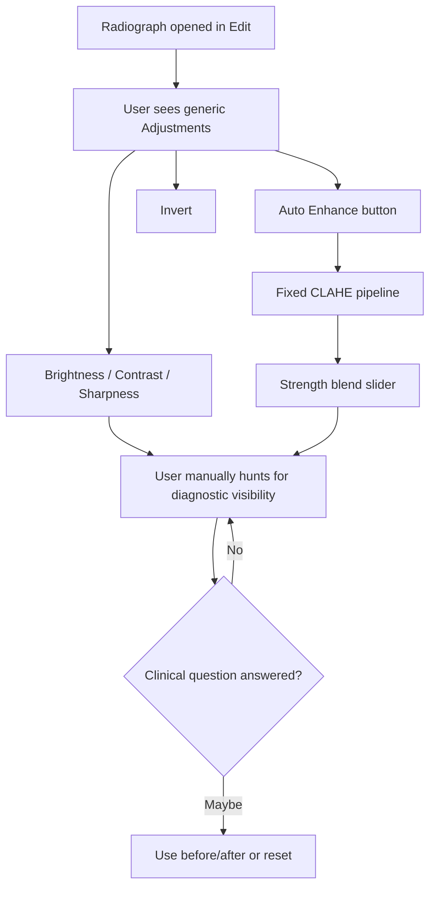
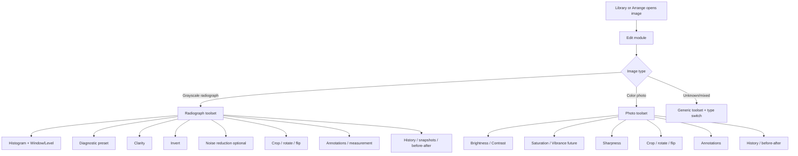
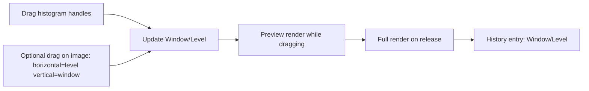
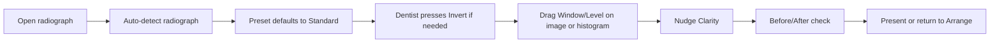

# Edit Module Radiograph UX Spec v1

Created: 2026-04-25  
Owner: Codex  
Scope: Edit/Review UX for single-image work, with radiograph enhancement as the primary clinical toolset.

## Executive Position

The Edit module should not present radiographs as generic photos with a few grayscale toggles. Dental radiographs need a radiology-style enhancement workflow:

- Window / Level for grayscale tone control.
- Task presets for common diagnostic reads.
- Clarity for multi-scale local contrast, not blunt CLAHE strength.
- Invert, crop, rotate/flip, before/after, history, and annotations as first-class clinical tools.
- Optional noise reduction after the core tone/clarity system is right.

Current production has a useful foundation: histogram, Auto Enhance, Strength, brightness, contrast, saturation, sharpness, invert, transform controls, crop, history, and adaptive radiograph/photo sections. But the current Auto Enhance model is too coarse for clinical radiograph review. The v4 UX should replace "make it better" with a small, clinically named toolkit that lets a dentist answer a specific diagnostic question quickly.

## Naming Note

Darrin has locked **Arrange** as the top-level module name and wants to keep **Template** in v4 UI copy. For Edit, this document uses **Edit** because that is the current v4 mockup vocabulary. Codex still believes **Review** may be more clinical, but this is not locked. Treat Edit/Review as an open vocabulary decision unless Darrin locks it.

## Current Implementation Snapshot

Current files:

| File | Relevant current behavior |
|---|---|
| `panels.py` | `AdjustmentsPanel`, histogram, Auto Enhance, Strength, sliders, invert, transform, crop controls |
| `adjustments.py` | `EditState` with brightness, contrast, saturation, sharpness, invert, rotation, flips, crop |
| `canvas.py` | render/apply pipeline, before/after, tools, panning/zooming |
| `history.py` | undo history and snapshots panel |
| `annotations.py` | brush, text, rectangle, ellipse, arrow, crop overlay |

Current radiograph-relevant controls:

- Histogram.
- Auto Enhance button.
- Strength slider, enabled only after Auto Enhance.
- Brightness.
- Contrast.
- Saturation disabled for grayscale.
- Sharpness.
- Rotate 90 clockwise / counter-clockwise.
- Flip horizontal / vertical.
- Invert (radiograph).
- Radiograph section showing "Auto-detected grayscale image."
- Crop apply/cancel when crop tool active.
- Reset All and Reset to Original.

Current engine:

- `EditState` is non-destructive.
- Rendering is two-tier: preview and full resolution.
- Grayscale detection samples RGB equality.
- Current enhancement is Pillow brightness/contrast/saturation/sharpness plus separate pixmap-level CLAHE blend for Auto Enhance.

## Current UX Problem



The problem is not that the current controls are useless. The problem is that they are generic and tool-centered. Dental radiograph review is question-centered:

- Is there interproximal caries?
- Is there apical pathology?
- Is the crestal bone level clear?
- Is the PDL space or lamina dura visible?
- Is the image too noisy, too flat, clipped, or inverted?

The UI should help users begin from the question, then refine.

## Future Edit Module Map



## Radiograph Right Panel Structure

Recommended right-panel tabs:

| Tab | Purpose |
|---|---|
| Info | Patient/image metadata, image type, capture date, source |
| Adjust | Radiograph enhancement controls |
| Draw | Annotation tools and selected annotation properties |
| Layers | Annotation visibility and ordering |
| History | Undo stack and snapshots |

Recommended Adjust tab for radiographs:

```text
Histogram
  - luminance histogram
  - clipping indicators later

Radiograph
  - Diagnostic preset
  - Window / Level
  - Clarity
  - Noise reduction optional
  - Invert

Transform
  - Rotate
  - Flip
  - Crop

Review
  - Before / After
  - Reset radiograph adjustments
  - Copy / Paste / Apply Previous
```

Photo Adjust tab remains separate:

```text
Histogram
Photo
  - Brightness
  - Contrast
  - Saturation
  - Sharpness
Transform
Review
```

## Radiograph Enhancement Toolset

### 1. Diagnostic Preset

Preset is the first control, because it maps to the clinical question.

Recommended initial presets:

| Preset | User intent | Technical meaning |
|---|---|---|
| Standard | General radiograph viewing | mild S-curve, low sharpening, minimal smoothing |
| Endo | Apical pathology / root canal detail | shadow lift, medium local contrast, conservative smoothing |
| Perio | Bone level / trabeculation | midtone stretch, medium clarity |
| Caries | Enamel and interproximal detail | highlight compression, high edge clarity, edge preservation |
| Flat | Remove enhancement | linear tone, no sharpening, no smoothing |

Interaction:

- Dropdown or segmented menu in the Radiograph section.
- Changing preset previews immediately.
- Preset choice is stored in edit state.
- Presets are starting points, not modal states; sliders below can refine.

### 2. Window / Level

Window/Level should replace Brightness/Contrast for radiographs.



UX details:

- Display as a histogram strip with two handles, plus numeric readouts.
- Support double-click label reset.
- Support arrow-key nudging when focused.
- Show clipping only if implemented clearly; do not add noisy warnings early.
- Keep Brightness/Contrast visible only for photos or under an "Advanced" disclosure for radiographs if needed for legacy compatibility.

### 3. Clarity

Clarity replaces the current Auto Enhance + Strength mental model.

Recommended:

- Bipolar slider: -100 to +100, default 0.
- Positive values increase local contrast and bone/enamel texture.
- Negative values soften noise and reduce harshness.
- Two-tier rendering: low-res preview while dragging, full-res on release.
- Store as a non-destructive edit parameter.

Clinical rule:

- Clarity must be edge-preserving and noise-aware.
- Avoid tile-boundary artifacts that could mimic pathology.
- Do not call this "AI" or imply diagnostic interpretation.

### 4. Invert

Invert remains first-class.

UX:

- Keep as an obvious toggle in the Radiograph section and a keyboard shortcut/tool-strip action.
- Label simply **Invert**; tooltip can say "Invert radiograph tones."
- Preserve current shortcut reference if already used.

### 5. Noise Reduction

Optional and lower priority than Window/Level and Clarity.

Recommended:

- Hide under an Advanced disclosure or place below Clarity.
- Default 0.
- Edge-preserving.
- Do not ship if tuning is not clinically reviewed.

### 6. Measurement

Radiograph ruler/measurement is listed in `UX_DESIGN_SESSION_Apr19.md` as a Develop backlog item. This is clinically important but not the first enhancement-tool step.

Recommended placement:

- Tool strip: Measure tool.
- Right panel when active: Calibration, units, line length, tooth/implant note.
- Requires calibration workflow before it can be trusted.
- Treat as v4.1 unless Darrin promotes it.

## Interaction Flow: Radiograph Review


## Interaction Flow: Fast Chairside Adjustment



Goal: a dentist should get to a readable radiograph in under 10 seconds without opening a dialog.

## Tool Priority Matrix

| Priority | Tool | Why |
|---|---|---|
| P0 | Window/Level | Correct mental model for grayscale diagnostic imagery |
| P0 | Diagnostic preset | Fast starting point tied to clinical task |
| P0 | Clarity | Replaces blunt CLAHE with useful local contrast |
| P0 | Invert | Common radiograph viewing need |
| P1 | Before/After | Prevents over-processing and builds trust |
| P1 | History snapshots | Lets user compare diagnostic tuning states |
| P1 | Crop / rotate / flip | Fixes orientation/framing before review |
| P2 | Noise reduction | Useful, but risky if poorly tuned |
| P2 | Copy/Paste/Apply Previous | Speeds series-wide consistency |
| P2 | Measurement | Clinically valuable but calibration-sensitive |
| P3 | Export presets | Valuable after review flow is stable |

## Current To Future Control Mapping

| Current control | Future radiograph state |
|---|---|
| Auto Enhance button | Remove after presets + clarity ship |
| Strength slider | Replace with Clarity |
| Brightness | Replace with Level for radiographs; keep for photos |
| Contrast | Replace with Window for radiographs; keep for photos |
| Saturation | Hidden/disabled for radiographs; keep for photos |
| Sharpness | Absorbed by preset/clarity for radiographs; keep for photos |
| Invert | Keep |
| Histogram | Upgrade into Window/Level control |
| Radiograph note | Replace with useful controls, not just a label |
| Reset All | Split into Reset Radiograph Adjustments and Reset to Original |

## Edit State Implications

Current `EditState` is too photo-generic for future radiograph controls.

Recommended additive future state:

```text
radiograph_preset: str | null
window: float | null
level: float | null
clarity: float
noise_reduction: float
legacy_brightness: float
legacy_contrast: float
legacy_auto_enhance_strength: float | null
```

Migration:

- Existing brightness/contrast continue to render.
- New radiograph controls should not destructively rewrite old values.
- If an image has old Auto Enhance + Strength, show a legacy badge or map approximately to Standard + low Clarity only if safe.

## Keyboard And Mouse UX

Recommended:

| Action | Shortcut / interaction |
|---|---|
| Before/After | `\` |
| Invert | `I` if no conflict |
| Window/Level image drag | hold a modifier or choose W/L tool first |
| Slider reset | double-click label |
| Slider fine nudge | focused slider arrow keys |
| Slider larger nudge | Shift + arrow |
| Lights out | `L` |
| Pan | hold Space + drag |

Important: do not overload too many single-letter shortcuts without a shortcut audit.

## UX States

### No Image Loaded

Right panel:

- Disabled controls.
- Empty state: "Open an image to adjust."
- Do not show radiograph-specific controls.

### Radiograph Loaded

Right panel:

- Radiograph section expanded by default.
- Photo-only controls hidden or disabled.
- Histogram/Window-Level visible.
- Preset = Standard by default, unless stored state exists.

### Photo Loaded

Right panel:

- Photo section expanded by default.
- Brightness/Contrast/Saturation/Sharpness visible.
- Radiograph controls hidden or collapsed.

### Unknown Type

Right panel:

- Generic controls visible.
- Small type selector: Radiograph / Photo.
- User override stored with the image.

## Visual Design Requirements

Inherit from v4 edit mockup and right-panel study:

- Dark shell.
- Peach accent `#e8a87c`.
- Low-radius buttons.
- Compact right-panel rows.
- Collapsible sections.
- Histogram as a functional control, not decoration.
- No marketing-style explanatory cards.
- Text must fit in panel rows.
- Tooltips for unfamiliar controls.

## Staged Implementation Recommendation

### Stage 1: UX Mockup And Control Contract

No code first. Produce HTML/CSS mockup states:

- Radiograph loaded, Standard preset selected.
- Window/Level handles in histogram.
- Clarity slider adjusted.
- Before/After active.
- Photo loaded, photo controls visible.
- Unknown image type with override selector.

### Stage 2: Data Model Extension

Add non-destructive edit state fields for radiograph tools while preserving legacy state.

### Stage 3: Window/Level

Implement W/L for grayscale images and keep photos unchanged.

### Stage 4: Clarity

Add multi-scale local contrast backend and preview/full-res rendering.

### Stage 5: Diagnostic Presets

Add presets after Window/Level and Clarity exist, so presets drive real controls.

### Stage 6: Legacy Auto Enhance Removal

Remove Auto Enhance and Strength only after replacement tools are stable.

### Stage 7: Measurement Tool

Build only after calibration UX is designed and approved.

## Open Decisions For Darrin

1. Should this module be called **Edit** or **Review** in v4?
2. Should Window/Level be controlled primarily by histogram handles, image drag, or both?
3. Are the initial presets Standard / Endo / Perio / Caries / Flat clinically right?
4. Should Clarity default to 0, or should Standard preset apply mild clarity automatically?
5. Is Measurement important enough for v4.0, or should it stay v4.1?

## Codex Recommendation

For v4.0, prioritize the radiograph read path:

1. Histogram + Window/Level.
2. Standard preset.
3. Clarity.
4. Invert.
5. Before/After.
6. History.

This gives PG a clinical advantage without pretending to diagnose. It also avoids the current failure mode where a single Auto Enhance button does too much and too little at the same time.

