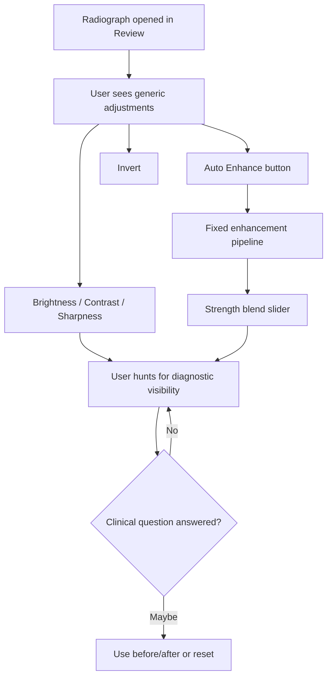
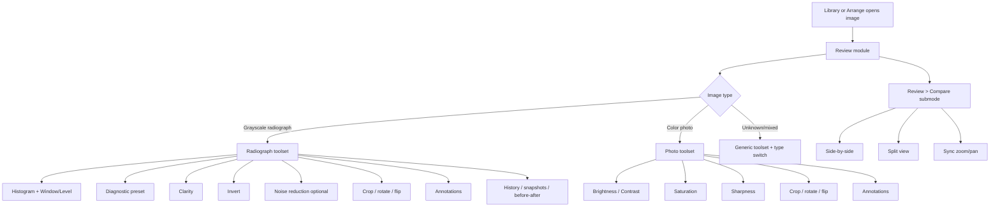
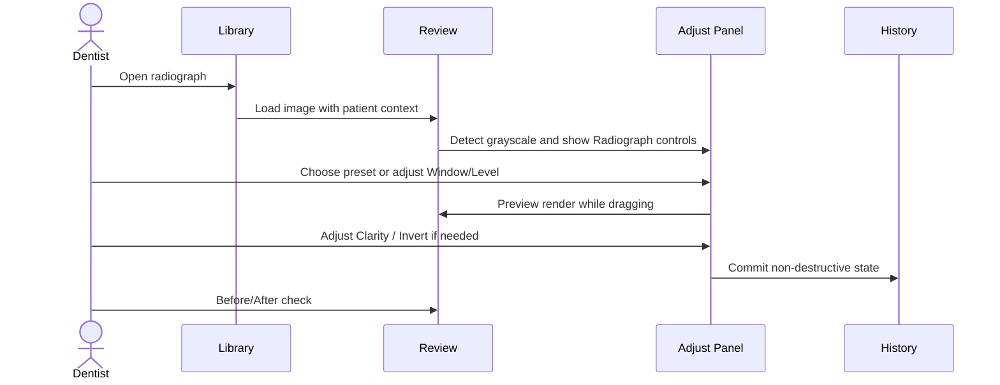
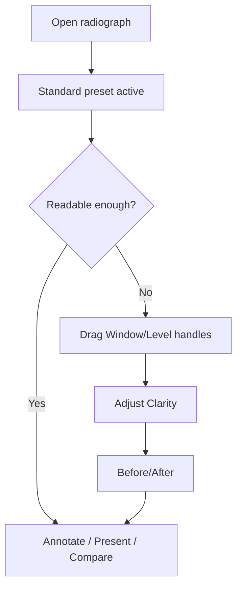

# Review Module Radiograph UX Spec v2

Created: 2026-04-25
Owner: Codex
Source v1: `C:\CODEX PG\CODEX PG Edit Module UX\CODEX_EDIT_MODULE_RADIOGRAPH_UX_SPEC_v1.md`
Authority: `C:\panda-gallery\PG_V4_MVP_PLAN.md`; locked module commit `d222719`
Scope: v2 cleanup of the radiograph Review module spec for the locked PG v4.0 module set.

## What Changed From v1

- The module name is now consistently **Review module**. Older "Edit module" wording is historical only.
- PG v4.0 module set is locked as **Library / Arrange / Review / Present**.
- Compare is explicitly a **Review submode**, not a top-level module.
- Retinex, super-resolution, adaptive guided filtering, diffusion, transformer restoration, panoramic de-shadowing, and other advanced engines are marked research-only for v4.0.
- Current PG Auto Enhance remains acknowledged as the shipping legacy behavior, while the future Review UX uses Window/Level plus Clarity as the clinical mental model.

> **Research-only (v4.0):** Retinex, super-resolution, adaptive guided filtering, wavelet/shearlet enhancement, transformer restoration, panoramic de-shadowing, diffusion/generative enhancement, and diagnostic AI overlays must not ship as visible v4.0 Review controls. They can be studied through local harnesses and v4.1+ planning only.

## Executive Position

The Review module should not present radiographs as generic photos with a few grayscale toggles. Dental radiographs need a radiology-style enhancement workflow:

- Window / Level for grayscale tone control.
- Task presets for common diagnostic reads.
- Clarity for conservative local contrast.
- Invert, crop, rotate/flip, before/after, history, and annotations as first-class clinical tools.
- Optional noise reduction after the core tone/clarity system is proven.

Current production has a useful foundation: histogram, Auto Enhance, Strength, brightness, contrast, saturation, sharpness, invert, transform controls, crop, history, and adaptive radiograph/photo sections. The v4.0 Review UX should keep the useful non-destructive foundation while moving the user-facing model away from a generic "make it better" button and toward clinically named controls.

## Module Naming Lock

Darrin locked the PG v4.0 module set at commit `d222719`:

```text
Library / Arrange / Review / Present
```

Relevant implications from `C:\panda-gallery\PG_V4_MVP_PLAN.md`:

- Review is the single-image inspect / adjust / annotate surface.
- `v4_0_edit_image_mockup.html` remains the binding visual target even though the file still carries older Edit vocabulary.
- `v4_0_comparison_mockup.html` is the visual target for **Review > Compare**.
- Compare is not a top-level module.
- AM v4 is dev-only internal tooling and is not a fifth clinical module.

## Current Implementation Snapshot

Current files:

| File | Relevant current behavior |
|---|---|
| `panels.py` | `AdjustmentsPanel`, histogram, Auto Enhance, Strength, sliders, invert, transform, crop controls |
| `adjustments.py` | `EditState` with brightness, contrast, saturation, sharpness, invert, rotation, flips, crop |
| `canvas.py` | render/apply pipeline, before/after, tools, panning/zooming |
| `history.py` | undo history and snapshots panel |
| `annotations.py` | brush, text, rectangle, ellipse, arrow, crop overlay |

Current radiograph-relevant controls:

- Histogram.
- Auto Enhance button.
- Strength slider, enabled only after Auto Enhance.
- Brightness.
- Contrast.
- Saturation disabled for grayscale.
- Sharpness.
- Rotate / flip.
- Invert.
- Crop.
- Reset All and Reset to Original.

Current engine:

- `EditState` is non-destructive.
- Rendering is two-tier: preview and full resolution.
- Current enhancement uses Pillow brightness/contrast/saturation/sharpness plus a separate pixmap-level Auto Enhance path.
- Current Auto Enhance is already shipping in PG and remains part of the current product behavior. The v4.0 spec does not erase that fact.

## Current UX Problem



The controls are useful, but tool-centered. Dental radiograph review is question-centered:

- Is there interproximal caries?
- Is there apical pathology?
- Is the crestal bone level clear?
- Is the PDL space or lamina dura visible?
- Is the image too noisy, too flat, clipped, or inverted?

## Future Review Module Map



## Radiograph Right Panel Structure

Recommended right-panel tabs:

| Tab | Purpose |
|---|---|
| Info | Patient/image metadata, image type, capture date, source |
| Adjust | Radiograph enhancement controls |
| Draw | Annotation tools and selected annotation properties |
| Layers | Annotation visibility and ordering |
| History | Undo stack and snapshots |

Radiograph Adjust tab:

```text
Histogram
Radiograph
  - Diagnostic preset
  - Window / Level
  - Clarity
  - Noise reduction optional
  - Invert
Transform
  - Rotate
  - Flip
  - Crop
Review
  - Before / After
  - Reset radiograph adjustments
  - Copy / Paste / Apply Previous
```

Photo Adjust tab stays separate:

```text
Histogram
Photo
  - Brightness
  - Contrast
  - Saturation
  - Sharpness
Transform
Review
```

## Radiograph Enhancement Toolset

### 1. Diagnostic Preset

Preset is the first control because it maps to the clinical question.

Recommended initial presets:

| Preset | User intent | Technical meaning |
|---|---|---|
| Standard | General radiograph viewing | mild S-curve, low sharpening, minimal smoothing |
| Endo | Apical pathology / root canal detail | shadow lift, medium local contrast, conservative smoothing |
| Perio | Bone level / trabeculation | midtone stretch, medium clarity |
| Caries | Enamel and interproximal detail | highlight compression, high edge clarity, edge preservation |
| Flat | Remove enhancement | linear tone, no sharpening, no smoothing |

Presets store Window/Level, Clarity, and Invert defaults as data. Parameter values remain tuning placeholders until Darrin reviews against real clinical images.

### 2. Window / Level

Window/Level should replace Brightness/Contrast as the primary radiograph mental model.

UX details:

- Histogram strip with black/white handles and numeric readouts.
- Double-click label reset.
- Arrow-key nudging when focused.
- Preview while dragging, full render on release.
- Brightness/Contrast can remain for photos or under Advanced for radiographs if legacy compatibility needs it.

### 3. Clarity

Clarity replaces the current Auto Enhance + Strength mental model.

Recommended:

- Bipolar slider: `-100` to `+100`, default `0`.
- Positive values increase local contrast and bone/enamel texture.
- Negative values soften noise and reduce harshness.
- Store as non-destructive edit state.

Clinical rule:

- Clarity must be edge-preserving and noise-aware.
- Avoid tile-boundary artifacts that could mimic pathology.
- Do not call this AI or imply diagnostic interpretation.

### 4. Invert

Invert remains first-class:

- Toggle in the Radiograph section.
- Keyboard/tool-strip access.
- Simple label: `Invert`.

### 5. Noise Reduction

Optional and lower priority:

- Hide under Advanced or below Clarity.
- Default `0`.
- Edge-preserving.
- Do not ship if tuning is not clinically reviewed.

### 6. Measurement

Measurement remains v4.1 unless Darrin explicitly promotes it. It needs calibration, units, persistence, and export before it can be trusted.

## Current PG Auto Enhance Distinction

PG's current Auto Enhance behavior is shipping legacy functionality. It is not the same thing as the future Clarity engine.

v4.0 distinction:

- **Shipping now:** current Auto Enhance / Strength behavior remains available unless and until replaced by approved Review work.
- **v4.0 Review UX target:** Window/Level, presets, Clarity, Invert, Before/After, Apply Previous.
- **Research-only:** new engines behind Clarity or presets require harness review before production selection.

## Lightroom / Photoshop Tool Translation

Lightroom and Photoshop are interaction references, not vocabulary authorities.

Recommended translations:

| Photo-editor term | PG term | v4.0 posture |
|---|---|---|
| Levels | Window/Level | Include |
| Blacks / Whites | Black Point / White Point | Include as histogram handles |
| Clarity | Clarity | Include, conservatively |
| Texture | Fine Detail | Research / v4.1 |
| Dehaze | Scatter Reduction | Research / v4.1 |
| Sharpening | Edge Detail | Research / v4.1 |
| Noise Reduction | Noise Reduction | Optional, clinically gated |
| Profiles | Diagnostic Presets | Include as data-driven presets |
| Copy/Paste Settings | Apply Previous / Copy Adjustments | Include |
| Healing / Clone / Generative Fill | Remove from diagnostic workflow | Exclude |

Guardrails:

- Keep creative color controls out of radiographs.
- Do not include pixel-removal tools in diagnostic radiograph mode.
- Any local adjustment must be visibly non-destructive.
- Any tool that changes perceived pathology needs conservative defaults, Before/After, and reset.

## Algorithm Research Boundaries

> **Research-only (v4.0):** The algorithm families below are not v4.0 shipping controls. They may inform harnesses, v4.1 planning, or future engine choices after Darrin reviews side-by-side output.

| Algorithm family | Possible future PG use | v4.0 status |
|---|---|---|
| Adaptive / gradient-domain guided filtering | Clarity / Fine Detail backend candidate | Research-only |
| Retinex / homomorphic normalization | Preset foundation for uneven exposure | Research-only |
| Multi-scale morphology | Perio/detail research | Research-only |
| Wavelet / shearlet enhancement | Fine Detail / denoise research | Research-only |
| Multi-grayscale fusion | Adaptive View preset | Research-only |
| Optimization-tuned enhancement | Preset tuning | Research-only |
| Panoramic de-shadowing | Panoramic-only artifact preview | Research-only |
| SwinIR / transformer restoration | Degraded bitewing restoration preview | Research-only |
| Deep-learning super-resolution | Zoom/export/research | Research-only |
| Diffusion / generative enhancement | Synthetic data or education only | Excluded from diagnostic Review |
| Diagnostic AI overlays | Future assist overlays | Not image enhancement, v4.1+ |

## Validation Matrix For Future Engine Work

Any future algorithm choice must be judged by clinical structure preservation, not only PSNR/SSIM:

- Tooth margins.
- Enamel-dentin boundary.
- PDL / lamina dura.
- Trabecular pattern.
- Root canal space.
- Mandibular canal for panoramic images.
- Noise, halos, tile artifacts, clipping.
- Reversibility and original access.

## Interaction Flow: Radiograph Review



## Interaction Flow: Fast Chairside Adjustment



## Tool Priority Matrix

| Priority | Tool | v4.0 posture |
|---|---|---|
| P0 | Window/Level | Core Review control |
| P0 | Invert | Core Review control |
| P0 | Before/After | Core trust control |
| P1 | Diagnostic Presets | Include as data-driven starting points |
| P1 | Clarity | Include with conservative implementation |
| P1 | Apply Previous / Copy/Paste | Include for series consistency |
| P2 | Noise Reduction | Optional, clinically gated |
| P2 | Fine Detail / Edge Detail | v4.1 research |
| P2 | Scatter Reduction | v4.1 research |
| P3 | Advanced Curve | v4.1+ power-user tool |
| P3 | Measurement | v4.1 unless promoted |

## Current To Future Control Mapping

| Current control | Future Review equivalent |
|---|---|
| Auto Enhance | Auto preset / legacy compatibility |
| Strength | Clarity or preset strength, not a separate legacy-only mental model |
| Brightness | Window/Level level or photo Brightness |
| Contrast | Window/Level window or photo Contrast |
| Sharpness | Research-only Fine Detail / Edge Detail |
| Saturation | Photo only |
| Invert | Invert |
| Crop / rotate / flip | Transform |
| History | Right-panel History |

## UX States

### No Image Loaded

- Show empty Review state.
- Primary action returns to Library.
- Radiograph controls disabled.

### Radiograph Loaded

- Radiograph controls auto-expanded.
- Photo saturation controls hidden or disabled.
- Preset and Window/Level visible.

### Photo Loaded

- Photo controls visible.
- Radiograph-specific controls hidden or collapsed.

### Unknown Type

- Generic controls shown.
- User can switch type.

## Staged Implementation Recommendation

1. HTML/CSS mockup for the Review radiograph right panel.
2. Data model extension for radiograph edit parameters.
3. Window/Level.
4. Clarity.
5. Diagnostic presets.
6. Apply Previous / Copy/Paste polish.
7. Research harness for candidate engines.
8. Legacy Auto Enhance migration or retirement plan.
9. Measurement tool later.

## Open Questions For Darrin

1. Should the v4.0 UI keep a visible `Auto` preset that mirrors current PG Auto Enhance, or should current Auto Enhance stay only as legacy compatibility until Review controls replace it?
2. What exact preset parameter values should ship after Darrin reviews clinical samples?
3. Should measurement remain fully v4.1, or does Darrin want a non-calibrated annotation-only ruler in v4.0?

## Codex Recommendation

Use the Review module as the clinical single-image surface. Ship the simple mental model first: preset, Window/Level, Clarity, Invert, Before/After, and Apply Previous. Keep current PG Auto Enhance visible as existing behavior, but do not expand it into a new algorithmic commitment. Treat advanced algorithms as research until harness output and Darrin review justify a production choice.
