# Panda Gallery Main App UX Flow Maps v1

Created: 2026-04-25  
Owner: Codex  
Scope: Main Panda Gallery clinical app UX, with special focus on Template Design / Freeform unification.  
Source policy: `C:\panda-gallery` read-only reference only.

## Executive Read

The current Panda Gallery production UX is not the design authority for v4. It is diagnostic evidence. Claude's v4 guidance is clear: current production is editor-centric, while v4 should be viewer-first and organized around a small module spine.

The current app has three overlapping arrangement concepts:

- Template Designer: blank reusable grid layout, movable slots, no patient images.
- Template View: fixed slot grid, patient images mounted into slots.
- Freeform Canvas: patient images placed freely on a canvas, separately saved as freeform state.

That split is the central UX fracture. It forces users to decide too early whether they are "designing a template," "mounting a series," or "starting freeform," even though clinically those are variations of one job: arrange patient media into a useful view.

The v4 direction should collapse Template and Freeform into one **Arrange** surface:

- Standard arrangements are canvases with semantically constrained slots.
- Freeform arrangements are canvases with few or no slot constraints.
- Both use one library, one editor shell, one save model, one thumbnail/rendering pipeline, and one right-panel inspector.
- Standard dental meaning must survive: slot order, sensor size, orientation, arch/region labels, required/optional slots, mount-all behavior, and future autofill/comparison semantics.

## Authority Stack

Use these in order when flow-map recommendations conflict:

1. `C:\panda-gallery\PG_V4_MVP_PLAN.md`
   v4.0 scope authority. Hard-gated 3-month window. Module set currently locked as Library / Arrange / Present.
2. `C:\panda-gallery\workflows\design\v4_0\v4_0_edit_image_mockup.html`
   Binding visual vocabulary reference.
3. `C:\panda-gallery\workflows\design\v4_0\v4_0_arrange_canvas_mockup.html`
   Strongest visual reference for the unified arrangement canvas.
4. `C:\panda-gallery\workflows\design\v4_0\v4_0_template_editor_mockup.html`
   Directional reference for template editing, not implementation authority.
5. `C:\panda-gallery\UX_DESIGN_SESSION_Apr19.md`
   Viewer-first redesign origin.
6. `C:\panda-gallery\PANDA_GALLERY_TEMPLATE_SPEC.txt` and `C:\panda-gallery\PANDA_GALLERY_FREEFORM_SPEC.txt`
   Retired as design authorities, but useful as preservation inventory.
7. Current source files:
   `panda_gallery.py`, `template_designer.py`, `template_view.py`, `template_data.py`, `dialogs.py`, `patient_panel.py`, `panels.py`.

## Vocabulary Decision Still Open

Claude's current v4 plan uses **Library / Arrange / Present**.

Codex's earlier mockup review preferred more clinical vocabulary: **Library / Mount / Review / Compare / Present**.

This v1 document does not silently rename modules. It uses the locked v4 terms for scope, while flagging clinical alternatives:

| Current v4 plan | Clinical alternative | Decision state |
|---|---|---|
| Library | Library | Stable |
| Arrange | Mount or Arrange | Open Darrin decision |
| Edit / Develop | Review | Open Darrin decision |
| Compare | Compare | Could be module or mode |
| Present | Present | Stable |

## Current-State Global UX Map

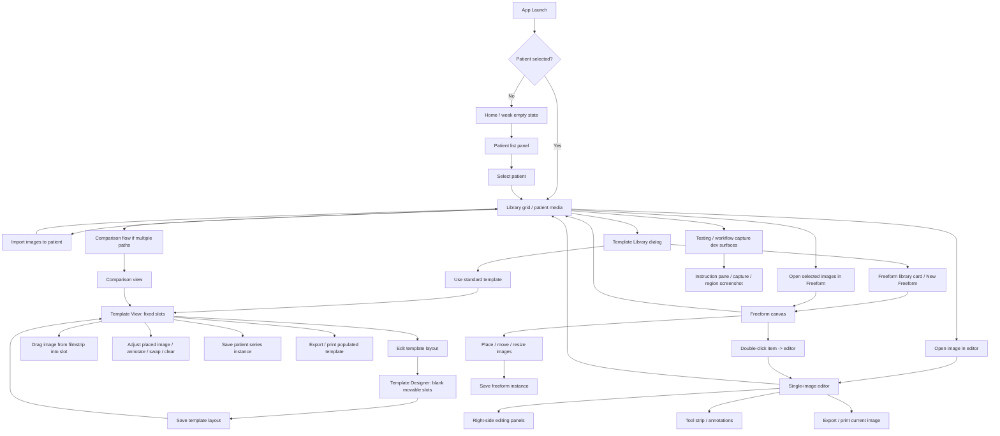

### Current-State Reading

The production app supports real clinical tasks, but the user's mental model is fragmented:

- Patient selection is separate from the image grid.
- Image editing is separate from Template View.
- Template layout editing is separate from filling a template.
- Freeform layout is separate from template layout, despite using the same patient-media job.
- Template Library mixes standard templates and a Freeform entry as peer cards, but the downstream editors diverge.
- Presentation exists as a plan and request, but is not yet a first-class module in the current clinical flow.
- Testing / audit surfaces exist and should move behind dev-only access, not leak into the clinical experience.

## Current Module Flow: Library

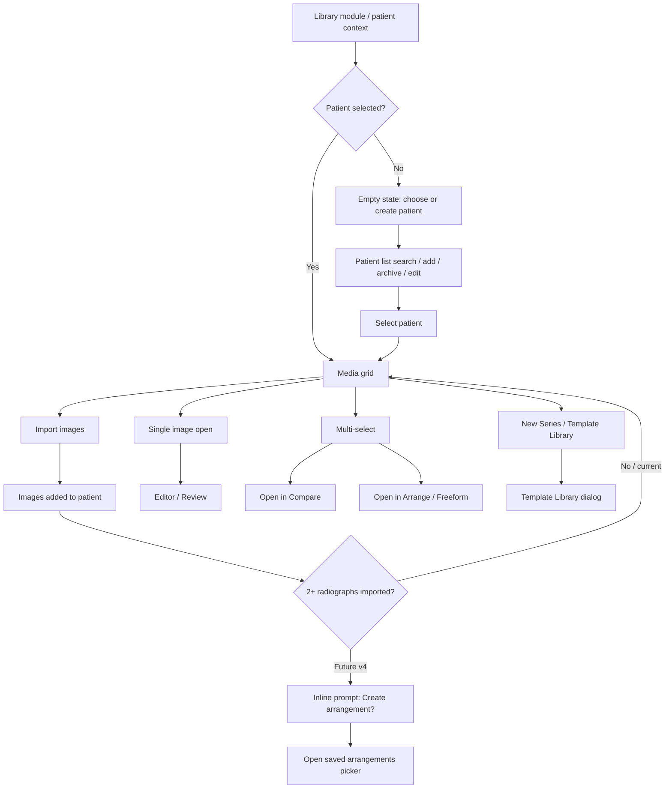

### Library Current Pain Points

| Area | Current behavior | UX risk | v4 direction |
|---|---|---|---|
| Launch state | Text exists but is too quiet | New user may not know to select patient | Strong empty state with first action |
| Library viewport buttons | Icon-only buttons in upper-right | Discoverability problem | Icon + text or tooltips per v4 shell |
| Patient context | Can be lost when moving across views | User disorientation | Browser-style Back/Forward and breadcrumb |
| New series entry | Template flow exists but is not obvious enough | User may import images and miss arrange step | Inline post-import prompt + New Arrangement button |
| Testing surfaces | Workflow/instruction tools visible historically | Clinical UI contamination | Dev-gated / undocumented hotkey only |

## Current Module Flow: Template Designer vs Template View

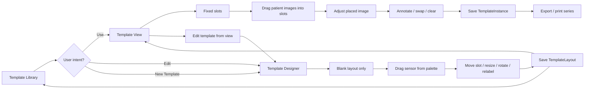

### Template Split Diagnosis

The old template spec explicitly says these are two separate screens and warns not to confuse them. That warning is now evidence of the design problem.

Clinically, the user does not experience "designing a layout" and "mounting a series" as separate worlds. They often discover layout needs while mounting real images:

- Slot order is wrong.
- One image needs more space.
- A patient-specific series needs an extra detail image.
- A standard FMX should become a slightly customized arrangement.

Today, that change forces a context switch into Template Designer and back, with save/refresh rules that users have to trust.

## Current Module Flow: Freeform

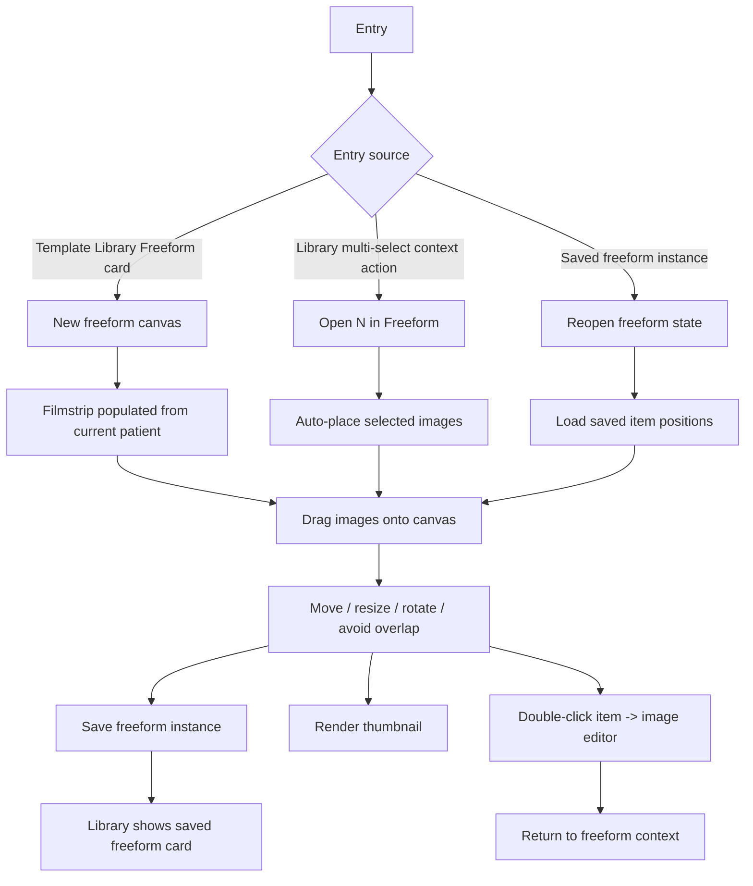

### Freeform Current Strengths

- It already matches the v4 direction better than Template Designer does.
- It lets users place patient images spatially instead of first designing blank slots.
- It has thumbnail rendering that is supposed to reflect the canvas exactly.
- It supports direct user composition and case-story layouts.

### Freeform Current Weaknesses

- It is still structurally separate from standard dental templates.
- It saves through a `layout_type: freeform` marker rather than a shared arrangement model.
- It depends on separate dirty-state, thumbnail, and reopen paths.
- It can become a generic canvas unless standard dental semantics are added deliberately.

## Future-State v4 Module Map

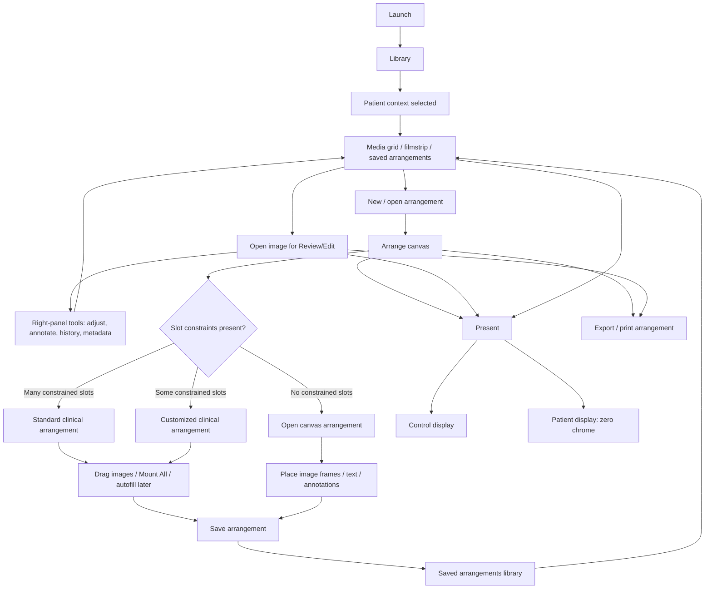

### Future-State Principle

The future module set should make one path feel natural:

1. Select patient.
2. Import or choose media.
3. Review individual media when needed.
4. Arrange media into a clinical or presentation layout.
5. Present or export.

The user should not need to understand which internal data model they are touching. Do not add a fourth top-level "Template Studio" module; layout editing belongs inside Arrange as an explicit "Edit Layout" affordance.

## Unified Arrange / Edit Layout Flow

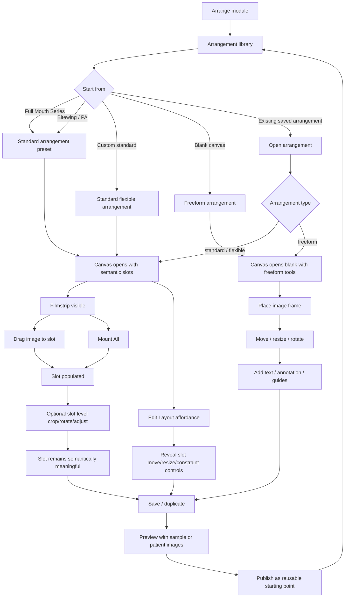

## Combined Arrangement Model

The combined model should not be "everything is freeform." That would erase clinical intelligence. It also should not require a user to choose "Standard mode" or "Freeform mode" at the door. Every arrangement is an arrangement; standard versus freeform is an emergent property of slot/object constraints.

Recommended conceptual rollups:

| Arrangement mode | User-facing meaning | Constraints | Data must preserve |
|---|---|---|---|
| Standard arrangement | Preset clinical series | Most slots have semantic constraints | slot index, sensor size, orientation, region label, required/optional |
| Customized clinical arrangement | Clinical series with layout edits | Some slots remain constrained, some locks relaxed | same as standard plus layout edits |
| Freeform arrangement | Open presentation/case canvas | Few or no constrained slots | object bounds, z-order, text, image frame, guides |

Recommended per-slot constraint fields:

| Field | Meaning |
|---|---|
| `constraints_active` | Slot carries dental semantics |
| `position_locked` | Slot center cannot move during normal mounting |
| `size_locked` | Slot dimensions cannot resize during normal mounting |
| `rotation_locked` | Slot cannot rotate during normal mounting |
| `expected_image_kind` | PA, bitewing, intraoral photo, extraoral photo, free, etc. |
| `expected_region` | UR molars, anterior, bitewing left, etc. |
| `slot_label` | User-visible clinical label |
| `required` | Missing media should be surfaced as incomplete |

Recommended user vocabulary:

- "Saved Arrangement" for the library object.
- "Standard" for dental semantic presets.
- "Freeform" for open canvas layouts.
- Avoid naming a top-level module "Template Studio"; layout editing is inside Arrange.
- "Arrange" for the top-level v4 module unless Darrin chooses "Mount."

## Preservation Inventory

Keep these concepts from current Template Designer / Template View:

| Preserve | Why |
|---|---|
| Sensor-shaped slots | Dental-specific building blocks, already familiar |
| Sensor size and orientation | Required for radiograph realism and future autofill |
| Slot number and label | Necessary for mount order and communication |
| Full Mouth / Bitewing / PA presets | High-value starting points |
| Drag from filmstrip to slot | Simple and direct |
| Mount All | Essential for speed |
| Save reusable starting layouts | Core user value |
| Export / print populated arrangement | Clinical communication value |
| Keyboard focus lessons from TemplateCard fixes | Accessibility should not regress |

Discard or replace these structures:

| Replace | Why |
|---|---|
| Designer/View split | Forces unnatural context switching |
| Separate Template and Freeform menus | Makes users choose internal model too early |
| TemplateCard plus FreeformLibraryCard split | Duplicates library concepts |
| TemplateLayout versus freeform state divergence | Causes persistence and thumbnail drift |
| Filter caches layered between MainWindow and TemplateLibraryDialog | History of brittle bugs |
| Modal-first template editing | Blocks fluid try/change/save workflows |

## Interaction Map: Standard Arrangement

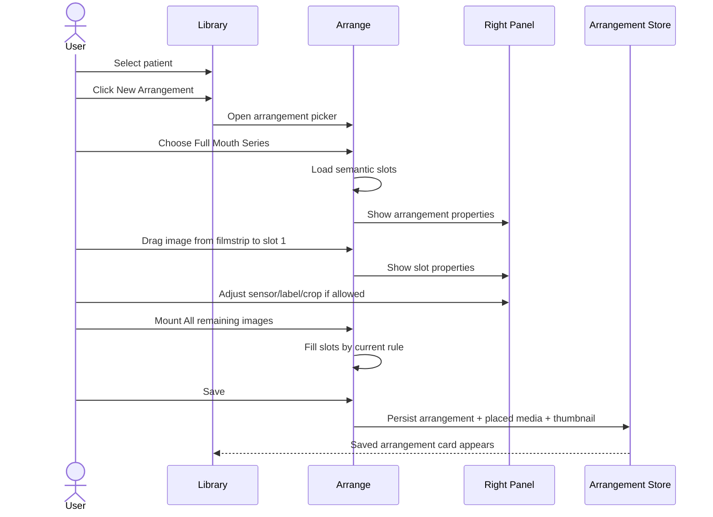

## Interaction Map: Freeform Arrangement

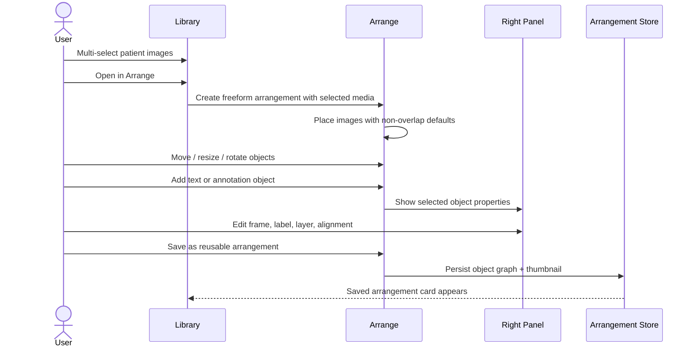

## Cross-Module User Jobs

### Job 1: Review A Patient Before Appointment

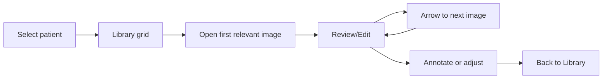

Key UX requirements:

- Patient context must remain visible.
- Back/Forward must restore patient and module context.
- Filmstrip navigation should be fast and keyboard-friendly.
- Edit state should autosave or clearly prompt.

### Job 2: Build A Full Mouth Series

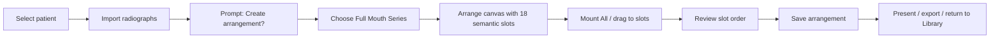

Key UX requirements:

- Standard arrangement presets must be obvious.
- Slot numbering and sensor orientation must be visible but not noisy.
- Mount All must be reversible.
- Missing images should leave clear empty slots, not silent gaps.

### Job 3: Make A Patient-Facing Case Story

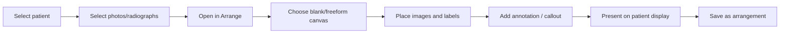

Key UX requirements:

- Freeform must be simple enough for chairside use.
- Text and annotation tools must be present but restrained.
- Presentation view must hide app chrome completely.

### Job 4: Compare Before/After

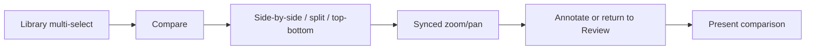

Decision note: Compare can be a top-level module or a mode inside Review/Arrange. Do not lock this without Darrin.

### Job 5: Present Chairside

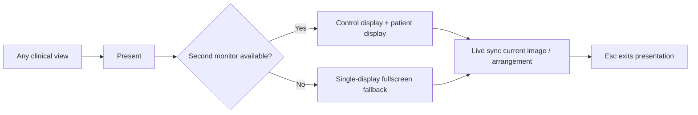

Key UX requirements:

- Patient display must be zero chrome.
- Control display should not leak implementation/testing UI.
- Monitor disconnect and DPI mismatch must fail gracefully.

## Current Implementation Reference Map

| UX surface | Current file(s) | Current role |
|---|---|---|
| Main app shell | `panda_gallery.py` | QMainWindow, menus, toolbar, central stack, wiring |
| Patient list | `patient_panel.py` | Patient selection, add/edit/archive/photo, import hooks |
| Right panels/tooling | `panels.py` | Adjustments, drawing, layers, tool strip |
| Template data | `template_data.py` | TemplateSlot, TemplateLayout, TemplateInstance, presets |
| Template Designer | `template_designer.py` | Blank slot layout editor |
| Template View | `template_view.py` | Populated fixed-slot series view |
| Template Library | `dialogs.py` | TemplateCard, FreeformLibraryCard, TemplateLibraryDialog |
| Freeform view | `panda_gallery.py` wiring plus freeform classes imported elsewhere | Patient-specific open canvas |
| Testing/dev surfaces | `instruction_pane.py`, `workflow_capture.py`, `region_capture.py` | Audit/dev tooling, not clinical v4 UX |

## Pain-Point Map

| Priority | Area | Problem | Recommendation |
|---|---|---|---|
| P0 UX architecture | Template + Freeform split | Two modules and data paths for one clinical job | Unified arrangement canvas |
| P0 scope control | v4.0 hard gate | Tempting to add everything while redesigning | Stage recommendations by tier |
| P1 discoverability | Launch and Library | New user may not know first action | Strong Library empty state |
| P1 continuity | Patient context | Moving between views can feel like leaving patient | Breadcrumb + Back/Forward |
| P1 Template Designer | Designer/View split | User must leave mounted series to edit layout | One Arrange surface with constraints |
| P1 persistence | Separate save paths | Template instances and freeform states diverge | One arrangement store |
| P1 thumbnails | Separate render paths | Template and freeform previews may not match | One renderer |
| P2 interaction | Right panel | Long scrolling and scattered properties | v4 right-panel study pattern |
| P2 accessibility | Template cards | Fixed bugs show fragility around keyboard focus | Keep card focus semantics in new library |
| P2 vocabulary | Arrange vs Mount | Existing names not clinically perfect | Darrin decision, document tradeoff |

## Staged Recommendation

### Stage A: UX Mapping And Visual Agreement

Output before code:

- Approve module vocabulary.
- Approve one unified Arrange flow with an Edit Layout affordance.
- Produce or update HTML/CSS mockups for:
  - Library with New Arrangement entry.
  - Arrangement library.
  - Standard arrangement canvas.
  - Freeform arrangement canvas.
  - Selected slot/object right-panel states.

No production code should start until the visual-first surfaces exist.

### Stage B: Data Model Planning

Define an `Arrangement` model that can represent:

- Standard preset with semantic slots.
- Flexible standard layout with moved slots.
- Freeform object canvas.
- Patient-specific placed media.
- Reusable starting layout.
- Thumbnail/render descriptor.

Migration planning:

- Existing `TemplateLayout` presets become standard arrangements.
- Existing `TemplateInstance` rows become patient arrangements.
- Existing freeform saved states become freeform arrangements.
- Back up DB before first v4 migration.

### Stage C: Shell And Navigation

Build Library / Arrange / Present shell first, with placeholders where needed.

Critical interactions:

- Ctrl+1/2/3 module switching if shortcut audit allows.
- Back/Forward restores patient + module + selected image/arrangement.
- Patient breadcrumb visible.
- Dev/testing tools hidden from clinical menu.

### Stage D: Unified Arrange Canvas

Replace the old Template Designer + Template View + Freeform split with one canvas:

- Standard/freeform behavior as per-slot constraints, not a separate module.
- Right panel changes based on selected slot/object.
- Filmstrip always available.
- Save/Duplicate/Publish/Export in one action area.
- Mount All for standard arrangements.
- Exact thumbnail renderer for all arrangement types.

### Stage E: Presentation

Add first-class Present module:

- Control screen.
- Patient screen.
- Single-monitor fallback.
- Arrangement and image presentation.
- No testing/audit UI leakage.

## Open Decisions For Darrin

1. Should the top-level module be named **Arrange** or **Mount**?
2. Should image editing be a top-level module in v4.0, or a Review/Edit state reached from Library and Arrange?
3. Should user-facing copy keep **Template**, shift to **Arrangement**, or use both in different contexts?
4. Should Compare be a top-level module, or a mode within Review/Arrange?
5. Should flexible standard behavior be exposed as "Edit Layout" only, or should users see a persistent "Customize Layout" state?
6. Is the Library / Arrange / Present three-module scope still the v4.0 hard gate after considering arrangement unification?

## Implementation Guardrails

- Do not recommend two separate template/freeform modules.
- Do not erase dental semantics by turning every template into arbitrary rectangles.
- Do not add visible AI features to v4.0.
- Do not bring testing/audit PASS/FAIL vocabulary into the clinical app.
- Do not expand v4.0 scope without a strategy note and Darrin approval.
- Do not code UI surfaces before visual mockups.
- Do not treat current Template Designer as the future foundation. Preserve concepts, not architecture.

## Next Flow-Map Artifacts

Recommended follow-up files:

1. `CODEX_TEMPLATE_STUDIO_OVERHAUL_SPEC_v1.md`
   Detailed flows for unified Arrange, per-slot constraints, and the "Edit Layout" affordance.
2. `CODEX_CURRENT_STATE_UX_INVENTORY_v1.md`
   Deeper per-file current implementation map.
3. `CODEX_V4_VISUAL_MOCKUP_GAP_LIST_v1.md`
   Which mockups exist, which states are missing, and what Claude Code would need before implementation.
4. `CODEX_CC_PROMPT_TEMPLATE_STUDIO_FLOWMAP_REVIEW.md`
   Claude Code-ready prompt for inspecting current implementation and preparing a no-code migration plan.
