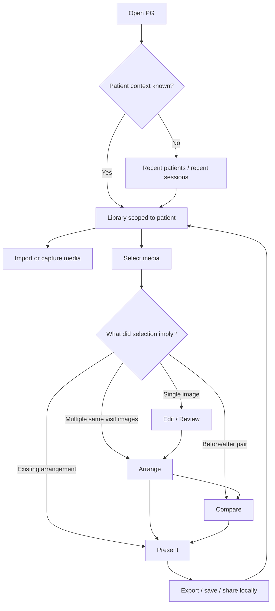
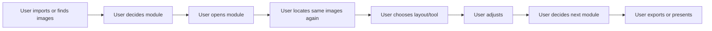
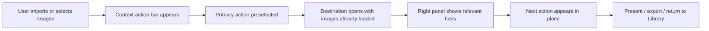
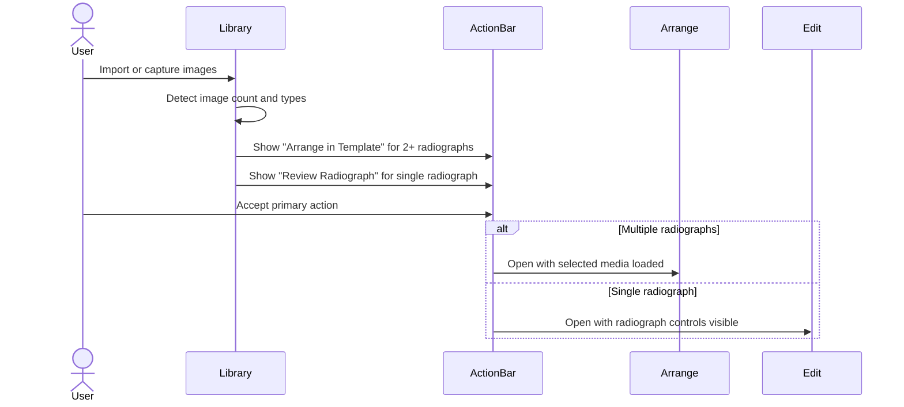
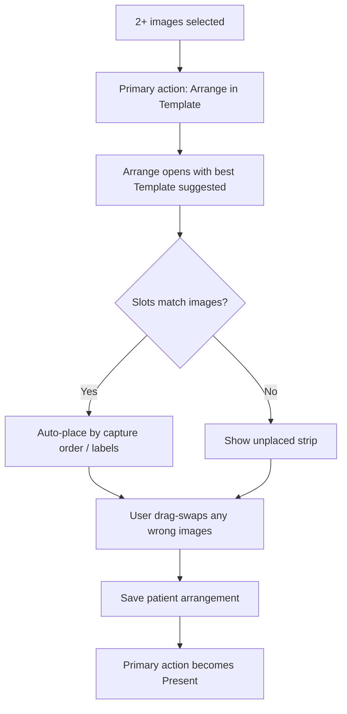
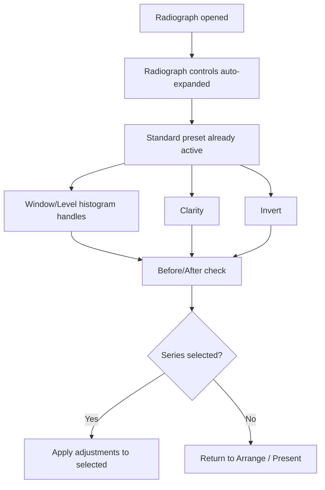
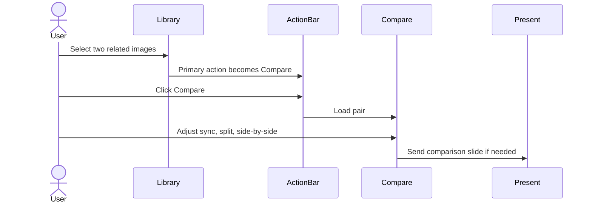
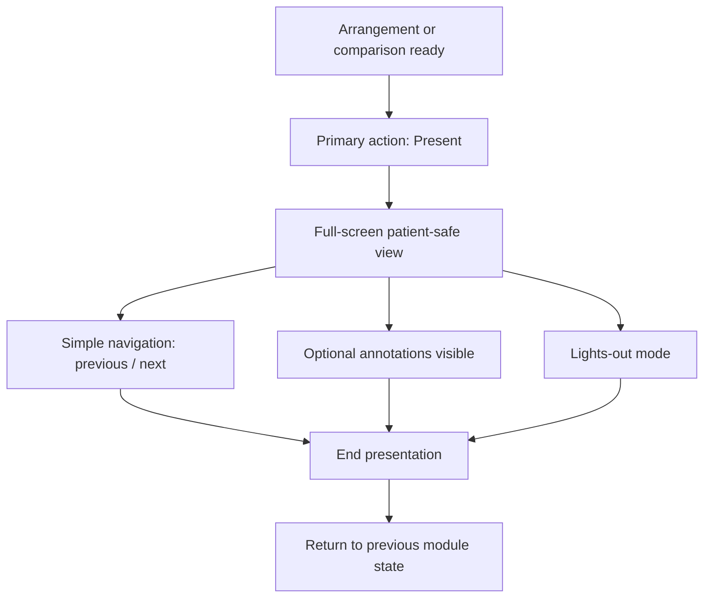
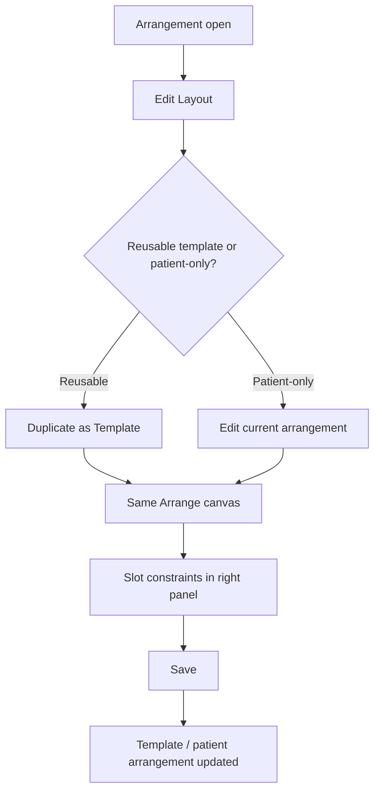

# Panda Gallery User Process Streamlining Map v1

Created: 2026-04-25  
Owner: Codex  
Scope: End-to-end user process map for reducing clicks, pointer travel, mode confusion, and repeated decisions across the Panda Gallery v4 app.

## Executive Position

Panda Gallery should feel like a clinical workbench, not a set of separate utilities. The app should infer the user's next likely action from context:

- New media imported -> offer the next best destination.
- Multiple radiographs selected -> offer Arrange with the right Template.
- One radiograph opened -> offer Edit/Review with radiograph controls already visible.
- Before/after or serial images selected -> offer Compare.
- Case images arranged -> offer Present.

The fastest interaction is not a shortcut. The fastest interaction is when the next correct action is already visible, close to the user's eye path, and safe to accept with one click.

## Streamlining Principles

| Principle | Meaning In PG |
|---|---|
| Context beats menus | Show the most likely next action in place rather than hiding it in menu bars |
| Selection drives action | Selecting images, arrangements, or a patient should reshape the action bar |
| One visible primary action | Each state should have exactly one recommended next step |
| Preserve dental semantics | Use Template, Series, Radiograph, Compare, Present instead of generic editor language |
| Fewer modes | Arrange covers standard templates and freeform layout; Edit covers photo/radiograph adjustments |
| Reuse recent intent | Recent template, patient, export destination, and presentation style should be one-click defaults |
| Direct manipulation first | Drag images to slots, drag Window/Level handles, drag reorder in filmstrip |
| Keyboard as acceleration, not dependency | Mouse-only users should be fast; shortcuts help expert repeat work |
| No dead ends | Every module exposes the next clinical destination: Arrange, Edit, Compare, Present, Export |

## Whole-App User Journey



Goal: the user should rarely decide which module to open from scratch. PG should infer likely intent from selected objects and surface one-click routes.

## Current Friction Pattern



Primary problem: the user repeatedly re-declares intent. The app should carry intent forward.

## Future Streamlined Pattern



The design target is not more shortcuts. It is fewer repeated context switches.

## Global Interaction Shell

Recommended persistent structure:

| Area | Streamlining role |
|---|---|
| Top module rail | Library, Arrange, Edit/Review, Compare, Present; stable locations |
| Context action bar | Changes with selection; always has one primary action |
| Filmstrip | Carries current patient/visit media across modules |
| Right panel | Shows object-specific tools without changing module |
| Inspector footer | Shows selected images, unsaved changes, active template, compare pair |
| Undo/history affordance | One consistent place; never buried in module-specific dialogs |

Primary global actions:

| Selection state | Primary action | Secondary actions |
|---|---|---|
| No selection | Import / Capture | Open recent patient, open recent session |
| One radiograph | Review Radiograph | Add to Template, Compare, Present |
| One photo | Edit Photo | Add to Template, Present |
| Two time-separated images | Compare | Arrange, Present |
| 2+ radiographs | Arrange in Template | Review selected, Compare series |
| Existing arrangement | Present | Edit Layout, Compare, Export |
| Unsaved arrangement | Save | Present, Export preview |

## Click Budget Targets

These are design targets, not implementation measurements.

| Job | Current likely pattern | Target pattern |
|---|---|---|
| Import images and arrange FMX | Import -> select -> open template dialog -> pick template -> place images | Import -> PG suggests FMX/Template -> user accepts -> auto-place -> adjust |
| Review one radiograph | Open image -> find adjustments -> auto enhance -> strength -> brightness/contrast | Open image -> Radiograph tools visible -> Standard preset already active -> Window/Level/Clarity tweak |
| Build patient presentation | Find arrangement -> open view -> choose present/export | Open arrangement -> Present is primary action |
| Compare before/after | Multi-select -> find compare command -> load images | Select pair -> Compare appears in action bar -> one click |
| Customize standard template | Open template designer separately -> recreate layout | Open arrangement -> Edit Layout -> duplicate if reusable -> edit same canvas |
| Apply same enhancement to series | Adjust each image manually | Adjust first -> Apply Previous / Paste Adjustments to selected |

## Job 1: Import New Visit Images



Streamlining rules:

- If imported set resembles FMX/BWX/PA series, suggest a matching Template without forcing a modal.
- Keep a small Change Template control near the canvas, not a blocking picker.
- Auto-place only when confidence is high; otherwise place in a left-to-right staging strip.
- Save import session context so returning to Library preserves selected images.

## Job 2: Arrange A Clinical Series



Friction reductions:

- Dragging an image over an occupied slot should swap by default, not require remove then add.
- Empty required slots should be visually obvious.
- Slot labels should be dental labels, not generic numbers.
- Template choice should be reversible without losing placed images.
- Standard and freeform editing should happen on the same canvas.

## Job 3: Edit / Review Radiographs



Friction reductions:

- Do not require clicking Auto Enhance before a strength slider becomes meaningful.
- Radiograph controls should replace photo controls by default when image type is detected.
- Use Apply Previous and Copy/Paste Adjustments to avoid per-image repetitive tuning.
- Keep Black/White point handles in the histogram if included; hide advanced detail tools until needed.
- Before/After must be one visible control and one shortcut, not buried in history.

## Job 4: Compare Before / After



Friction reductions:

- If two images share tooth/region metadata but different dates, Compare should be the first suggestion.
- If one arrangement contains before/after states, Compare should offer pairs automatically.
- Comparison controls should be visible: side-by-side, split, overlay if safe, sync zoom/pan.
- Present from Compare should preserve the chosen comparison mode.

## Job 5: Present Chairside



Friction reductions:

- Present should be reachable from any completed arrangement or comparison in one click.
- Present should hide implementation details, file names, and technical warnings.
- The user should return to the exact previous working state when leaving Present.
- If export/share is local-only, it should appear after presentation, not interrupt setup.

## Job 6: Customize Or Create Templates



Friction reductions:

- No separate Template Designer module for normal use.
- Edit Layout must be visible enough for discoverability; right-click can be supplemental.
- Reusable-vs-patient-specific save choice should happen when needed, not before editing begins.
- Standard and freeform are constraint levels inside the same canvas.

## Click-Saving Features To Add

| Feature | Where | Clicks saved | Notes |
|---|---|---|---|
| Context action bar | Global shell | High | Converts selection into next action |
| Recent Template memory | Library/Arrange | Medium | Defaults to clinic's last/common template |
| Smart Template suggestion | Import/Library | High | Suggest FMX/BWX/PA layouts from count/type |
| Auto-place with staging strip | Arrange | High | Fast when correct, recoverable when wrong |
| Drag-swap slots | Arrange | Medium | Removes delete/reinsert loops |
| Apply Previous | Edit/Review | High | Essential for series consistency |
| One-click Before/After | Edit/Review | Medium | Prevents over-processing |
| Compare from pair selection | Library/Arrange | High | Removes module hunting |
| Present as post-save primary | Arrange/Compare | Medium | Matches clinical sequence |
| Return-to-source state | Present/Edit/Compare | Medium | Prevents navigation rebuilding |
| Inline Change Template | Arrange | Medium | Avoids modal restart |
| Global undo/history | Shell/right panel | Medium | Reduces fear of exploration |

## Things To Avoid

| Anti-pattern | Why it hurts |
|---|---|
| Separate Template and Freeform modules | Forces users to choose implementation model before clinical intent |
| Modal-only template designer | Breaks the workbench flow and hides spatial context |
| Generic photo editor control stack for radiographs | Makes clinical review slower and less trustworthy |
| Too many top-level buttons | Increases decision time even if every feature is useful |
| Hidden right-click-only actions | Good accelerators, poor discoverability |
| Keyboard-only efficiency | Excludes mouse-first clinical users |
| Multiple save concepts | Makes users wonder whether they saved image, layout, patient arrangement, or reusable template |
| Creative editing tools in radiograph mode | Undermines clinical trust |

## Module-Specific Streamlining

### Library

Primary job: choose patient/media and launch the next task.

Recommended:

- Keep patient/recent session context persistent.
- Multi-select should immediately reshape the action bar.
- Imported image sets should remain selected after import.
- Provide one primary action per selection state.
- Thumbnail cards should expose only the next meaningful actions on hover/focus.

### Arrange

Primary job: turn selected media into a clinically meaningful layout.

Recommended:

- Use one Arrange canvas for standard templates and freeform layouts.
- Keep Template vocabulary for user-facing layout choices.
- Provide visible Edit Layout control.
- Slot constraints live in right panel.
- Unplaced images stay in a persistent strip until used.
- Save action decides patient arrangement vs reusable template based on context.

### Edit / Review

Primary job: make an image readable and useful without destroying clinical evidence.

Recommended:

- Auto-detect radiograph/photo and show the correct tool set.
- Radiographs: Window/Level, Clarity, Invert, Before/After, Apply Previous.
- Photos: exposure/color/crop tools, but avoid cluttering radiographs with photo controls.
- History snapshots should be visible but compact.
- Measurement waits until calibration UX is safe.

### Compare

Primary job: show difference between related images.

Recommended:

- Pair selection should launch Compare directly.
- Sync zoom/pan should be on by default.
- Side-by-side should be default; split view should be one click.
- Compare should send its current view to Present.

### Present

Primary job: show the patient a clean story.

Recommended:

- One-click entry from arrangement or comparison.
- Hide editing chrome.
- Keep navigation minimal.
- Return to exact prior state.
- Local export comes after the presentation path, not before it.

## Priority Roadmap For Streamlining

### Streamline 1: Context Action Bar

Add global action-bar logic tied to selection state. This is the highest leverage improvement because it reduces module hunting everywhere.

### Streamline 2: Unified Arrange Canvas

Collapse Template Designer, Template View, and Freeform into one Arrange canvas with slot constraints. This removes the biggest mental-model split.

### Streamline 3: Radiograph Review Defaults

Make radiograph controls appear automatically and replace Auto Enhance with Window/Level + Clarity. This reduces repetitive manual enhancement.

### Streamline 4: Series Operations

Add Apply Previous, Copy/Paste Adjustments, drag-swap slots, and bulk add to Template. This attacks repeated work.

### Streamline 5: Compare And Present Routes

Make Compare and Present reachable from selection/action context rather than separate destinations users must remember.

## Open Decisions For Darrin

1. Should the global primary action be a visible action bar, or should it live mostly in the right panel?
2. Should PG default to opening imported multi-image radiograph sets in Arrange automatically, or should it ask first?
3. Should Edit be renamed Review for clinical image work?
4. Should Present be a full top-level module, or primarily a mode launched from Arrange/Compare?
5. Should Apply Previous apply only within the same image type, or across selected radiographs regardless of source?

## Codex Recommendation

Start with the global context action bar and the unified Arrange canvas. Those two changes remove the most repeated decisions. Then improve Edit/Review defaults for radiographs, because every saved click in radiograph enhancement compounds across a full series.

The guiding behavior should be:

```text
Select media -> PG suggests next clinical action -> user accepts or changes it -> PG carries context forward.
```

That is the shortest path to an intuitive app.
