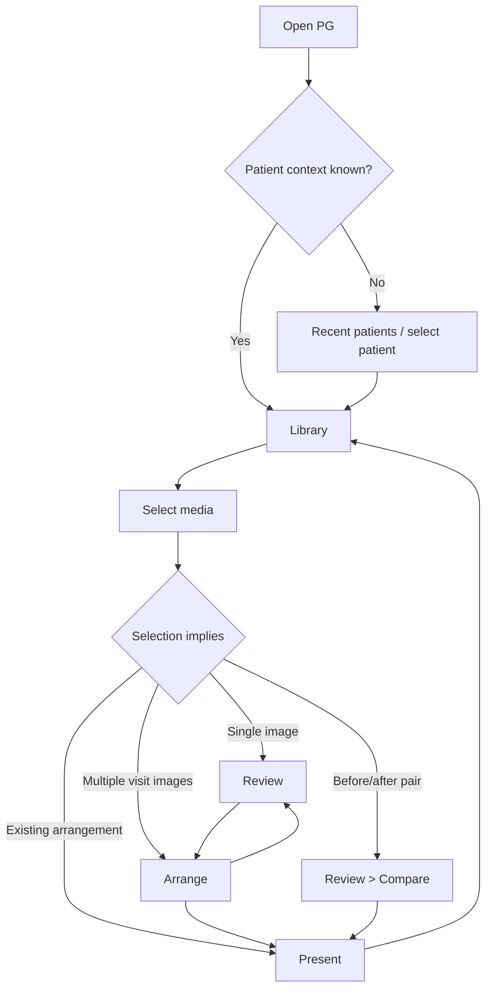
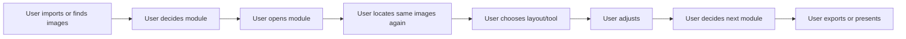
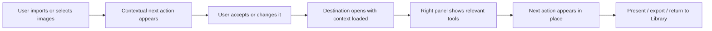
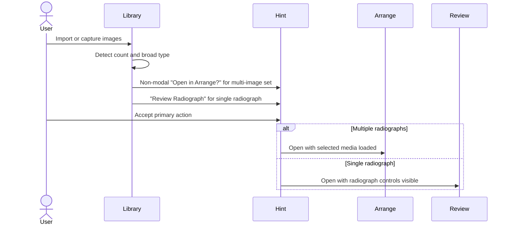
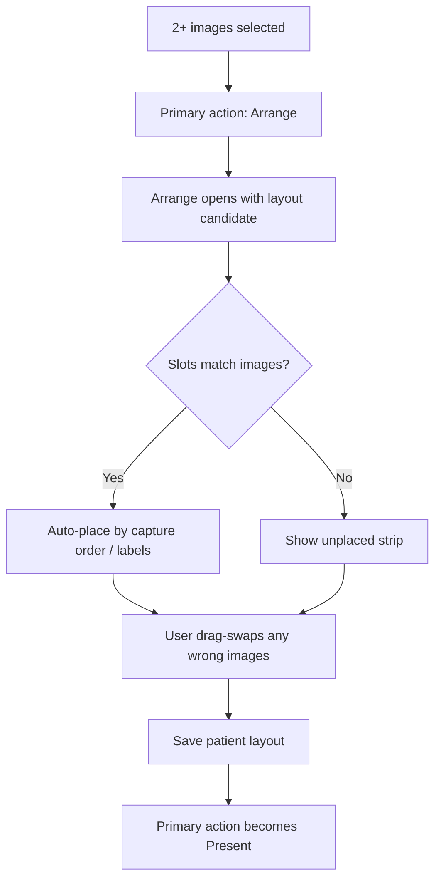
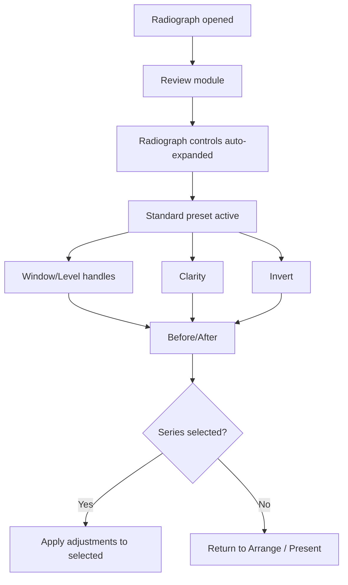
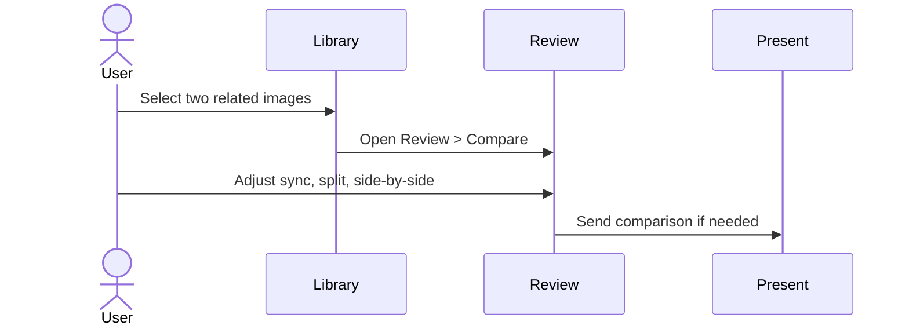
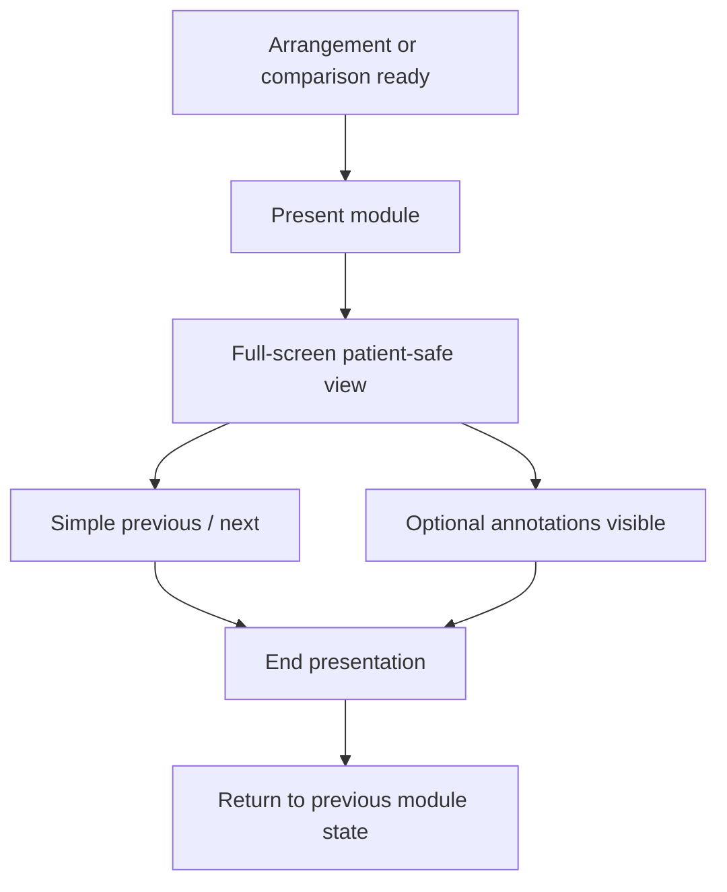
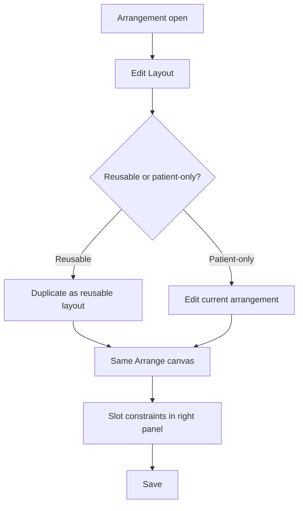

# Panda Gallery User Process Streamlining Map v2

Created: 2026-04-25
Owner: Codex
Source v1: `C:\CODEX PG\CODEX PG Main UX Flow Maps\CODEX_PG_USER_PROCESS_STREAMLINING_MAP_v1.md`
Authority: `C:\panda-gallery\PG_V4_MVP_PLAN.md`; locked module commit `d222719`
Scope: v2 cleanup of the process-streamlining map for the locked PG v4.0 module set.

## What Changed From v1

- Locked the v4.0 module list as **Library / Arrange / Review / Present**.
- Removed the old Present-as-mode question. Present is a top-level module.
- Moved this map to **v4.1+ input**. PG v4.0 flows are locked by `PG_V4_MVP_PLAN.md`.
- Reframed Compare as **Review > Compare**, not a top-level module.
- Retained useful streamlining ideas as backlog candidates rather than v4.0 implementation asks.

## Release Scope

This document is a v4.1+ input map.

PG v4.0 is hard-gated around the four locked modules:

```text
Library / Arrange / Review / Present
```

This map should not be used to expand v4.0 scope. Its proposals inform later streamlining after the v4.0 shell and module flows are stable.

## Executive Position

Panda Gallery should feel like a clinical workbench, not a set of separate utilities. The app should carry user intent forward:

- New media imported -> offer an appropriate next step.
- Multiple radiographs selected -> offer Arrange with the right template/saved-arrangement candidate.
- One radiograph opened -> open Review with radiograph controls visible.
- Before/after or serial images selected -> offer Review > Compare.
- Case images arranged -> offer Present.

The fastest interaction is when the next correct action is visible, close to the user's eye path, and safe to accept with one click.

## Streamlining Principles

| Principle | Meaning In PG |
|---|---|
| Context beats menus | Show likely next actions in place rather than hiding them in menu bars |
| Selection drives action | Selected images, arrangements, or patient context shape available actions |
| One visible primary action | Each state should have one recommended next step |
| Preserve dental semantics | Use clinical vocabulary: radiograph, series, arrangement/template, compare, present |
| Fewer mode splits | Arrange covers template-like and freeform layout work |
| Reuse recent intent | Recent layout, patient, export destination, and presentation style become defaults |
| Direct manipulation first | Drag images to slots, drag Window/Level handles, reorder in filmstrip |
| Keyboard accelerates | Mouse-only users remain fast; shortcuts help repetition |
| No dead ends | Every module exposes the likely next clinical destination |

## Locked Whole-App Journey



## Current Friction Pattern



Primary problem: the user repeatedly re-declares intent.

## Future Streamlined Pattern



## Global Interaction Shell For v4.1+

The v1 global context action bar idea is useful, but not v4.0 scope.

Recommended v4.1+ shell roles:

| Area | Streamlining role |
|---|---|
| Top module rail | Locked modules: Library, Arrange, Review, Present |
| Context action area | Selection-driven primary action, v4.1 candidate |
| Filmstrip | Carries patient/visit media across modules |
| Right panel | Object-specific tools without module hunting |
| Inspector footer | Selected images, unsaved changes, current layout, compare pair |
| Undo/history affordance | One consistent place, not buried in dialogs |

Primary contextual actions:

| Selection state | Primary action | Secondary actions |
|---|---|---|
| No selection | Import / Capture | Open recent patient, recent session |
| One radiograph | Review Radiograph | Add to Arrange, Compare, Present |
| One photo | Review Photo | Add to Arrange, Present |
| Two related images | Review > Compare | Arrange, Present |
| 2+ radiographs | Arrange | Review selected, compare pair |
| Existing arrangement | Present | Edit Layout, Compare, Export |
| Unsaved arrangement | Save | Present, Export preview |

## Job 1: Import New Visit Images



Rules:

- Do not auto-switch modules after import.
- Use a non-modal next-step suggestion.
- Auto-place only when confidence is high; otherwise stage images visibly.
- Preserve imported selection when returning to Library.

## Job 2: Arrange A Clinical Series



Friction reductions:

- Dragging over an occupied slot swaps by default.
- Empty required slots are obvious.
- Slot labels use dental labels.
- Layout choice is reversible without losing placed images.
- Template/freeform differences are handled inside Arrange.

## Job 3: Review Radiographs



Friction reductions:

- Radiograph controls replace photo controls by default.
- Apply Previous and Copy/Paste prevent repetitive tuning.
- Before/After stays visible.
- Advanced radiograph algorithms remain research-only for v4.0.

## Job 4: Compare Before / After



Friction reductions:

- Pair selection exposes Compare directly.
- Sync zoom/pan defaults on.
- Side-by-side defaults; split view one click.
- Present preserves chosen comparison mode.

## Job 5: Present Chairside

Present is a top-level v4.0 module.



Friction reductions:

- Present reachable from completed arrangements or comparisons.
- Present hides implementation details.
- Leaving Present restores the prior working state.
- Export/share follows presentation; it does not interrupt setup.

## Job 6: Customize Or Create Templates / Arrangements

Vocabulary remains open. See template spec v2 for the Template vs Saved Arrangement vs Arrangement question.



Rules:

- No separate Template Studio module.
- Edit Layout belongs in Arrange.
- Right panel is the primary surface; context menu is the secondary affordance.
- Reusable-vs-patient-specific save choice happens when needed.

## v4.1+ Click-Saving Backlog

| Feature | Where | Release tag | Notes |
|---|---|---|---|
| Context action area | Global shell | v4.1+ | Deferred; not in v4.0 shell lock |
| Recent layout memory | Library/Arrange | v4.1+ | Defaults to clinic's common layout |
| Smart layout suggestion | Import/Library | v4.1+ | Suggest, do not auto-switch |
| Auto-place with staging strip | Arrange | v4.1+ polish | Recoverable when wrong |
| Drag-swap slots | Arrange | v4.0/v4.1 depending fit | Core Arrange ergonomics |
| Apply Previous | Review | v4.0 target | Series consistency |
| One-click Before/After | Review | v4.0 target | Trust and over-processing guard |
| Compare from pair selection | Library/Review | v4.0 target as Review submode | No fifth module |
| Present as post-save primary | Arrange/Review | v4.0 target | Present is top-level |
| Return-to-source state | Present/Review | v4.1+ polish | Navigation stack dependent |
| Inline Change Layout | Arrange | v4.1+ | Avoid modal restart |
| Global undo/history | Right panels | v4.1+ | Avoid fear of exploration |

## Things To Avoid

| Anti-pattern | Why it hurts |
|---|---|
| Separate Template and Freeform modules | Forces implementation-model choices before clinical intent |
| Modal-only template designer | Breaks workbench flow |
| Generic photo controls for radiographs | Slows clinical review |
| Too many top-level buttons | Increases decision time |
| Hidden right-click-only actions | Poor discoverability |
| Keyboard-only efficiency | Excludes mouse-first users |
| Multiple save concepts | Makes users wonder what was saved |
| Creative editing tools in radiograph mode | Undermines clinical trust |
| AM as a clinical module | Violates AM v4 internal-tool boundary |

## Module-Specific Streamlining

### Library

- Preserve patient/recent context.
- Keep imported sets selected.
- Expose one primary action per selection state.
- Thumbnail actions stay minimal.

### Arrange

- One canvas for template-like and freeform layouts.
- Slot constraints live in right panel.
- Unplaced images stay in a strip.
- Edit Layout is visible when context requires it.

### Review

- Auto-detect radiograph/photo.
- Radiographs: Window/Level, Clarity, Invert, Before/After, Apply Previous.
- Photos: exposure/color/crop tools.
- Compare is a Review submode.

### Present

- Top-level module.
- One-click entry from arrangement or Review > Compare.
- Patient-safe view with minimal chrome.
- Return to exact prior state.

## v4.1+ Priority Roadmap

### Streamline 1: Context Action Area

Preserve the v1 idea, but keep it out of v4.0. It should be reconsidered once the four-module shell has real usage data.

### Streamline 2: Import Suggestions

Use non-modal suggestions such as `Open in Arrange?`; do not auto-switch based only on multi-image import.

### Streamline 3: Series Operations

Add or polish Apply Previous, Copy/Paste Adjustments, drag-swap slots, and bulk layout operations.

### Streamline 4: Compare And Present Routes

Make Review > Compare and Present reachable from context without adding a Compare module or demoting Present to a mode.

## Open Questions For Darrin

1. Should the global context action idea return in v4.1 as a visible bar, a right-panel affordance, or both?
2. Should Apply Previous apply only within the same image type, or across selected radiographs regardless of source?
3. Once v4.0 ships, which click-budget target should be measured first: import-to-arrange, review-one-radiograph, compare-before-after, or chairside-present?

## Codex Recommendation

Treat this map as v4.1+ planning input. For v4.0, defend the locked module set and avoid shell churn. After the four-module shell is real, use observed friction to decide whether a global context action area is worth adding.
