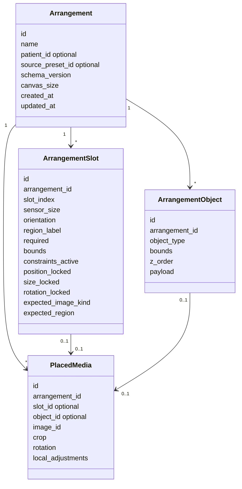
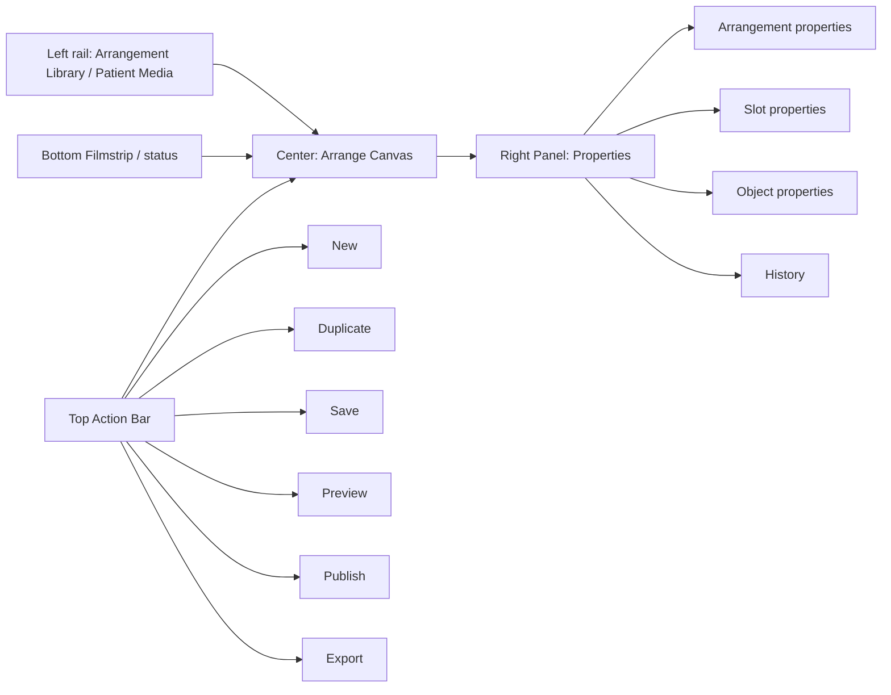
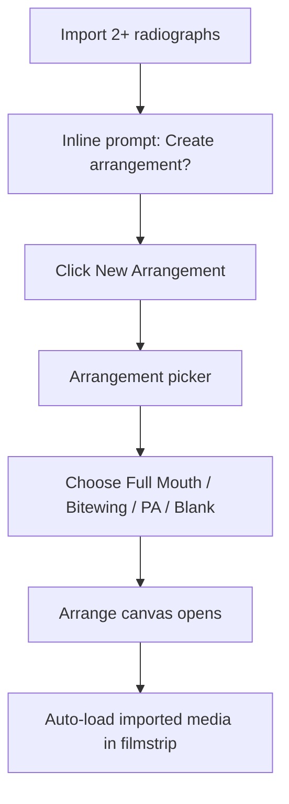
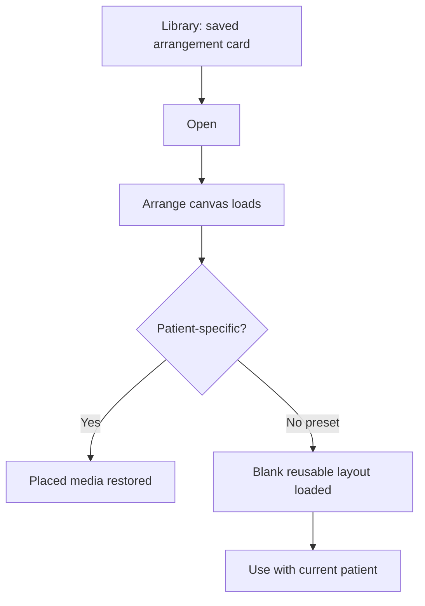
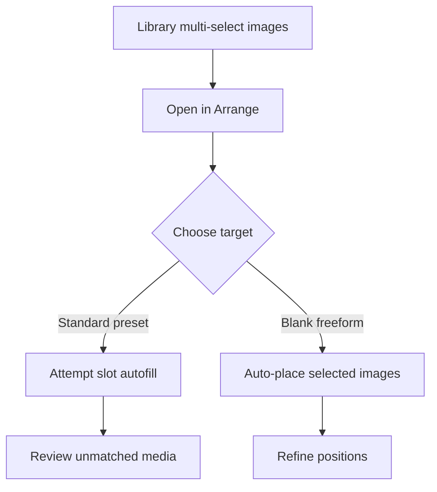
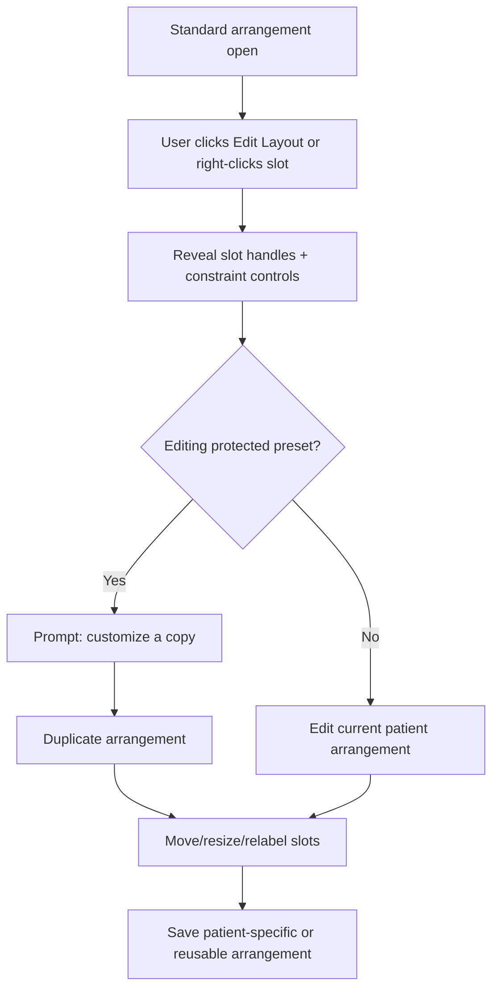
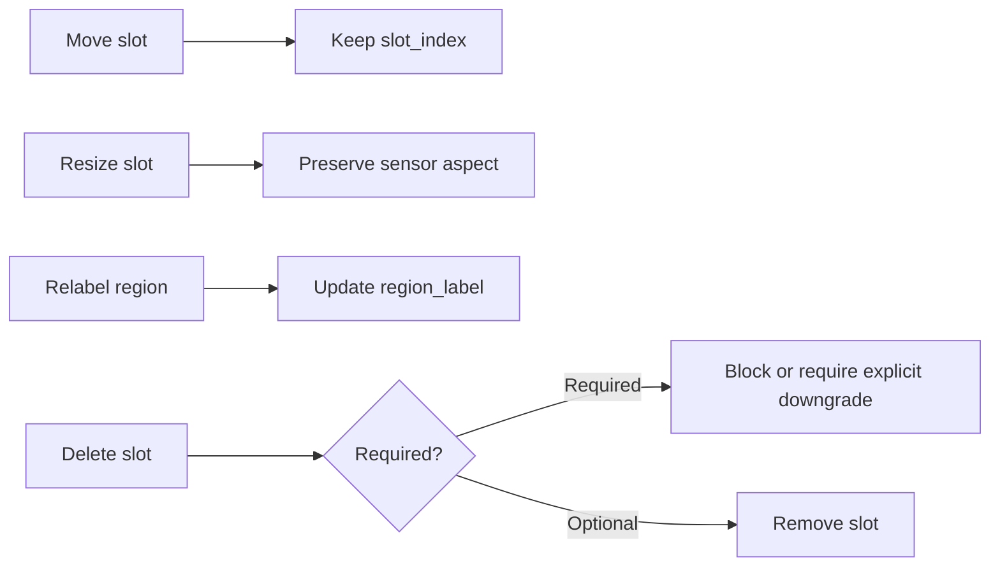
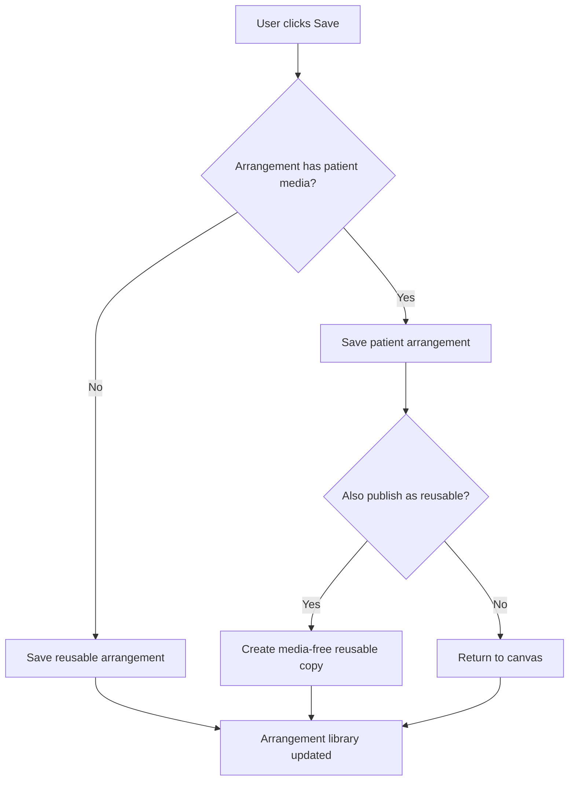

# Unified Arrange / Template Overhaul Spec v1

Created: 2026-04-25  
Owner: Codex  
Scope: UX architecture for replacing the current Template Designer / Template View / Freeform split.

## Core Position

Freeform templates and standard templates should be combined into one arrangement system, but not by reducing standard dental templates to generic canvas rectangles.

The right model is:

```text
One module: Arrange
One authoring surface: Arrange canvas
One storage model: Arrangement
Fine-grained constraints: per-slot, not a coarse top-level mode
```

Standard templates keep dental intelligence. Freeform layouts keep creative freedom. The module shell, save flow, library, thumbnail renderer, and right-panel inspector are shared. Do not create a fourth top-level "Template Studio" module; layout design affordances live inside Arrange.

## Why The Current Module Is Broken

The current `PANDA_GALLERY_TEMPLATE_SPEC.txt` says:

- Template Designer is for blank movable slots.
- Template View is for fixed slots with patient images.
- Slot dragging belongs only in the editor.
- Patient images do not appear in the designer.

That separation is exactly the thing v4 should remove.

Users discover layout needs while working with real images. They should be able to:

- start with a standard FMX
- mount images
- realize one slot needs to move
- switch that arrangement from locked to flexible
- adjust the slot
- save it as a patient arrangement or reusable arrangement

Today that job crosses multiple screens and concepts. In v4, it should stay on one canvas.

## Proposed Object Model



## Constraint Rollups

These are user-facing descriptions, not necessarily stored enum values. The durable data should live on slots and objects.

### Standard Arrangement

User-facing: Standard Template or Standard Arrangement.

Best for:

- Full Mouth Series
- Bitewing Set
- Periapical Series
- any layout where clinical slot identity matters

User can:

- fill slots
- clear slots
- swap slots
- crop/rotate image inside slot
- adjust placed image
- annotate placed image
- save patient arrangement
- duplicate as flexible layout

User cannot by default:

- move slots
- resize slots
- change sensor aspect ratio
- delete required slots

### Customized Clinical Arrangement

User-facing: Custom Standard Arrangement or Customize Layout.

Best for:

- standard layout with a few custom changes
- uncommon image count
- practice-specific mount
- modified FMX

User can:

- move slots
- resize slots while preserving sensor aspect ratio
- add slots from sensor palette
- delete optional slots
- relabel slots
- toggle required/optional
- save as reusable arrangement

Important: slot semantics survive every edit.

### Freeform Arrangement

User-facing: Freeform Arrangement.

Best for:

- patient-facing explanation
- case story
- photo collage
- mixed photo/radiograph layout
- teaching or marketing-style presentation

User can:

- place image frames anywhere
- add text blocks
- add callouts
- align/distribute objects
- use guides/snap/grid
- layer objects
- save as reusable arrangement

Important: freeform objects may be clinically tagged later, but no rigid dental slot semantics are required.

## Per-Slot Constraint Fields

| Field | Purpose |
|---|---|
| `constraints_active` | Whether a slot carries clinical semantics |
| `position_locked` | Prevents accidental slot movement during normal mounting |
| `size_locked` | Preserves intended sensor dimensions |
| `rotation_locked` | Preserves intended portrait/landscape orientation |
| `expected_image_kind` | Expected PA, bitewing, intraoral photo, extraoral photo, or free |
| `expected_region` | UR molars, anterior, BW left, etc. |
| `slot_label` | Visible clinical label |
| `required` | Controls incomplete/missing-slot signaling |

## New UX Surface



### Left Rail

Contains:

- saved arrangements
- presets
- recent patient arrangements
- filters: Standard, Freeform, Favorites, Archived

Rules:

- no separate Template Library dialog for normal use
- modal library allowed only as a temporary migration bridge
- thumbnails use one renderer
- search filters a single source of truth

### Center Canvas

Contains:

- standard slots
- freeform objects
- placed media
- guides / snap grid
- selection handles
- patient-safe stage color from v4 vocabulary

Rules:

- no nested card UI around the canvas
- visual vocabulary inherited from approved v4 mockups
- selected item gets right-panel context

### Right Panel

Changes by selection:

| Selection | Sections |
|---|---|
| Nothing / canvas | Arrangement name, mode, canvas size, preset lineage, publish/export |
| Standard slot | Slot label, sensor size, orientation, required/optional, tooth/region, fill state |
| Placed image | Crop, rotate, local adjustments, annotations, replace/clear |
| Freeform object | Position, size, layer, align, opacity, content |
| Text | Font, size, color, alignment, content |

Right panel must follow `v4_0_right_panel_study.html` patterns: collapsible sections, compact slider anatomy, copy/paste/previous support where relevant.

## Start Flows

### Start From Library After Import



### Start From Saved Arrangement



### Start From Multi-Select



## Edit Flows

### Reveal Edit Layout Affordances



### Preserve Clinical Semantics While Editing



## Save / Publish Flow



## Migration From Current State

| Current object | Future object | Notes |
|---|---|---|
| `TemplateLayout` preset | reusable `Arrangement` with constrained slots | Preserve slot order, labels, sensor size |
| `TemplateInstance` | patient-specific `Arrangement` | Preserve placed media and slot states |
| Freeform saved state | patient-specific `Arrangement` with unconstrained objects | Preserve object bounds and z-order |
| `TemplateLibraryDialog` | Arrangement Library surface | Avoid dual filter caches |
| `TemplateCard` | Arrangement card | Same card for standard/freeform, with mode badge |
| `FreeformLibraryCard` | New Blank Freeform action | Not a separate saved-object type |

## What Not To Build

- A generic whiteboard pretending to replace dental templates.
- Separate Template and Freeform modules.
- A modal-only template designer.
- Two thumbnail renderers.
- Two persistence paths.
- A preference-heavy customization system in v4.0.
- Visible AI arrangement suggestions in v4.0.

## Minimum Elegant Overhaul

If v4.0 cannot absorb a full design-app rebuild, the minimum elegant version is:

1. One Arrange module.
2. One arrangement library.
3. Standard presets open on the same canvas as freeform.
4. Standard slots have lock flags by default.
5. "Edit Layout" reveals slot movement and constraint controls while preserving slot semantics.
6. Freeform starts from blank canvas in the same module.
7. One Save action handles patient arrangement vs reusable arrangement.
8. One thumbnail renderer handles every arrangement.
9. Old Template Designer is hidden or retired once migration is complete.

## Decisions Needed Before Implementation

| Decision | Recommended default |
|---|---|
| User-facing module name | Arrange for v4 plan consistency; revisit Mount only with Darrin |
| Authoring surface name | Avoid visible "Studio"; use Arrange plus "Edit Layout" |
| Flexible standard exposure | Expose as "Edit Layout" rather than a permanent mode toggle |
| Saved object name | Saved Arrangement |
| Preset category name | Standard |
| Freeform category name | Freeform |
| DB storage for v4.0 | SQLite rows, not `.pga` files |
