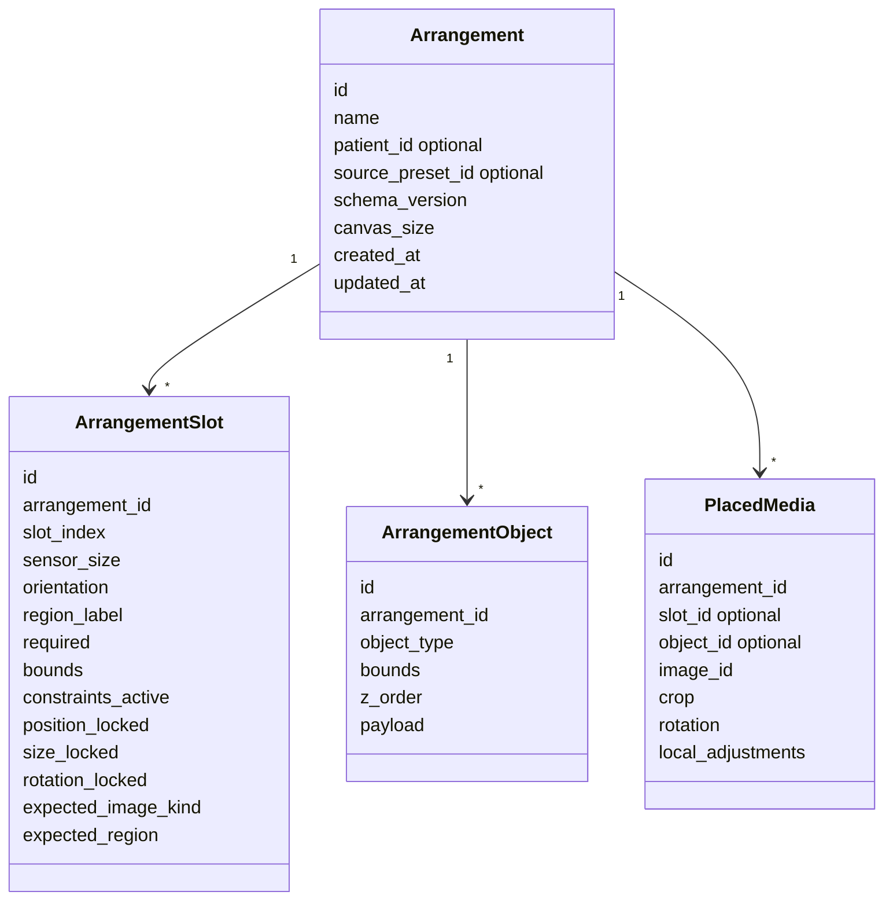
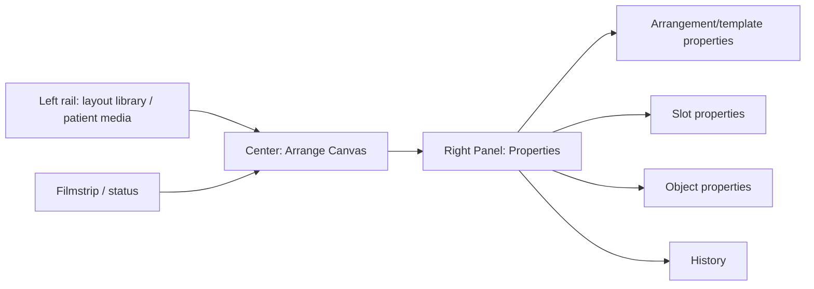
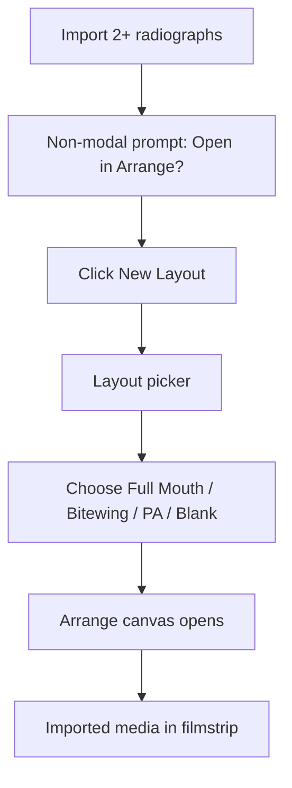
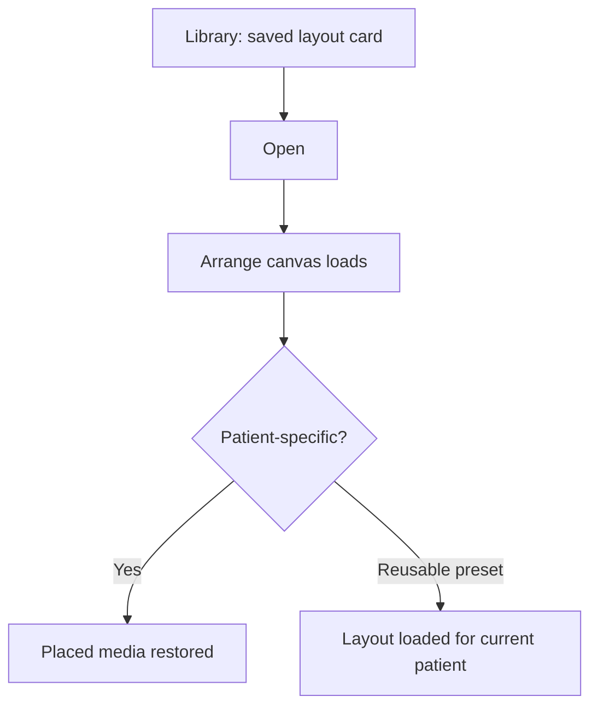
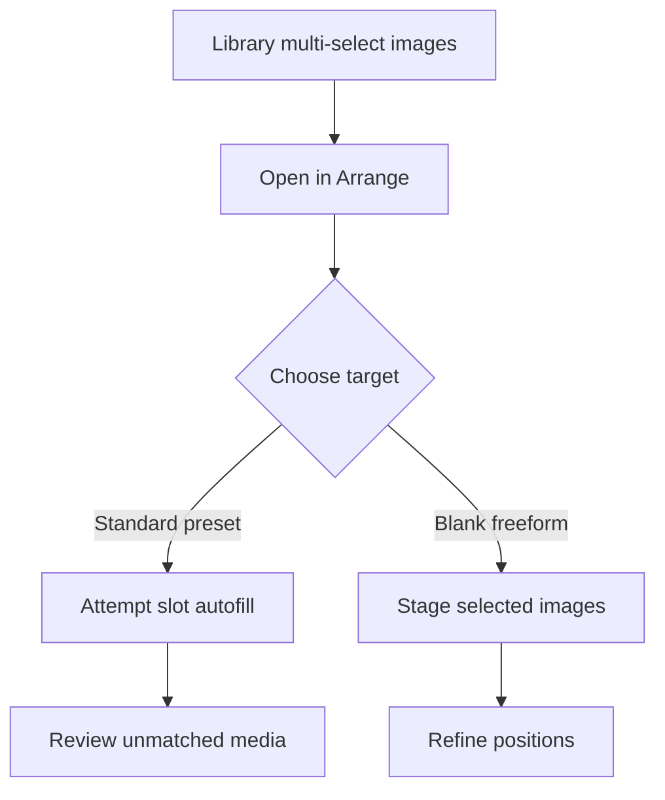
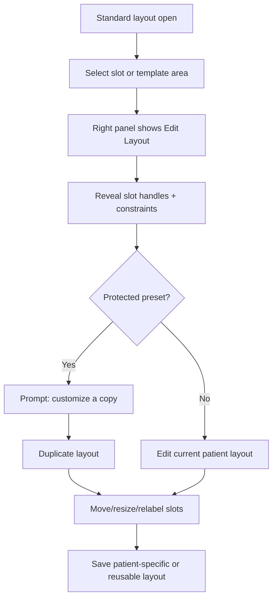
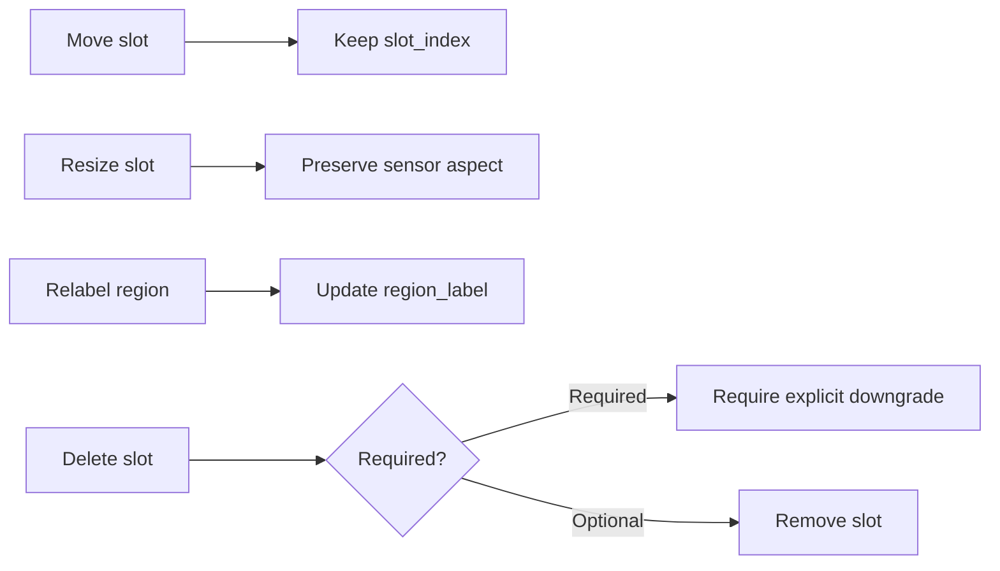
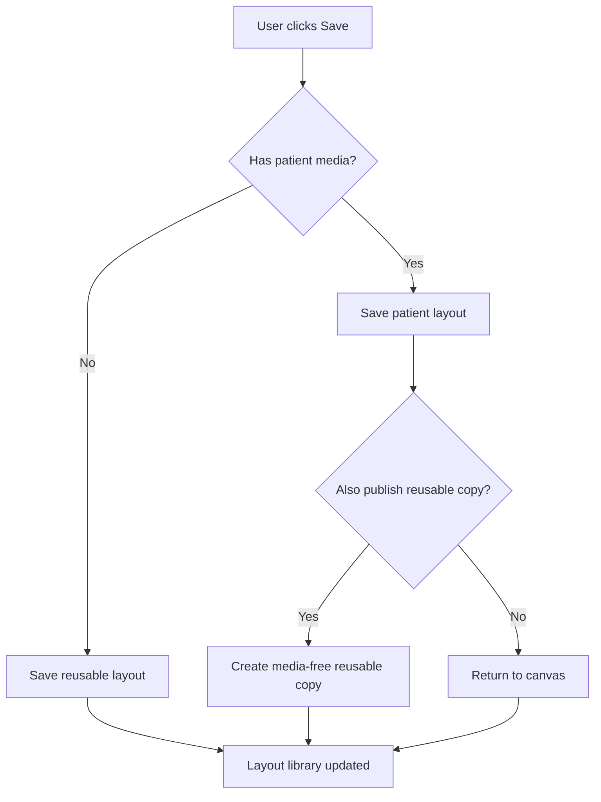

# Unified Arrange / Template Overhaul Spec v2

Created: 2026-04-25
Owner: Codex
Source v1: `C:\CODEX PG\CODEX PG Main UX Flow Maps\CODEX_TEMPLATE_STUDIO_OVERHAUL_SPEC_v1.md`
Authority: `C:\panda-gallery\PG_V4_MVP_PLAN.md`; locked module commit `d222719`
Scope: v2 cleanup of the template/arrangement overhaul spec for locked PG v4.0 vocabulary and scope.

## What Changed From v1

- Reconfirmed that the surface belongs inside **Arrange**, one of the four locked v4.0 modules.
- Added an explicit open vocabulary question: `Template` vs `Saved Arrangement` vs `Arrangement`.
- Marked this overhaul document as **v4.1 design input** for deeper vocabulary, library, and authoring polish. The v4.0 plan still includes a unified Arrange canvas, but this spec should not expand v4.0 beyond `PG_V4_MVP_PLAN.md`.
- Preserved v1's core design ideas: one canvas, one storage model, per-slot constraints, shared thumbnails, and Edit Layout affordances.
- Removed any implication that a separate Template Studio module should exist.

## Scope Lock

PG v4.0 modules are locked:

```text
Library / Arrange / Review / Present
```

Template/freeform consolidation happens inside **Arrange**. There is no fifth module and no top-level Template Studio.

This v2 spec is a design-cleanup and v4.1+ input document. v4.0 implementation should follow `C:\panda-gallery\PG_V4_MVP_PLAN.md` first.

## Open Question: Template vs Saved Arrangement vs Arrangement

Darrin has not finalized the user-facing noun.

Candidates:

| Candidate | Strength | Cost / risk |
|---|---|---|
| `Template` | Existing PG user/code vocabulary; familiar; maps to current Full Mouth/Bitewing mental model | Too narrow for freeform/patient-specific layouts; implies a separate designer |
| `Saved Arrangement` | Accurate for reusable layouts without overloading template semantics | Longer label; less familiar; may feel abstract |
| `Arrangement` | Clean umbrella for standard, customized, and freeform layouts | Broadest rename; needs careful onboarding and migration language |

Existing PG code uses `Template`, `TemplateLayout`, `TemplateInstance`, `TemplateLibraryDialog`, and related names. Renaming is breaking at the implementation, migration, docs, and user-memory levels. This spec therefore uses `arrangement/template` language where needed and does not pick a final noun.

## Core Position

Freeform templates and standard templates should be combined into one arrangement system, but not by reducing standard dental templates to generic canvas rectangles.

The right model is:

```text
One module: Arrange
One authoring surface: Arrange canvas
One storage model: arrangement/template record
Fine-grained constraints: per-slot, not a coarse top-level mode
```

Standard layouts keep dental intelligence. Freeform layouts keep creative freedom. The module shell, save flow, library, thumbnail renderer, and right-panel inspector are shared.

## Why The Current Split Is Broken

The current template model separates:

- Template Designer for blank movable slots.
- Template View for fixed slots with patient images.
- Freeform as a separate conceptual path.

Users discover layout needs while working with real images. They should be able to:

- start with a standard FMX,
- mount images,
- realize one slot needs to move,
- reveal Edit Layout,
- adjust the slot,
- save patient-specific or reusable output,
- stay on the same Arrange canvas.

## Proposed Object Model



This object model is conceptual. Final v4.0 schema must respect `PG_V4_MVP_PLAN.md` and the actual migration constraints in `template_data.py`, `template_view.py`, `template_designer.py`, and `freeform_view.py`.

## Constraint Rollups

These are user-facing descriptions, not necessarily stored enum values. Durable behavior lives on slots and objects.

### Standard Template / Standard Arrangement

Best for:

- Full Mouth Series.
- Bitewing Set.
- Periapical Series.
- Layouts where clinical slot identity matters.

User can:

- fill slots,
- clear slots,
- swap slots,
- crop/rotate image inside slot,
- adjust placed image,
- annotate placed image,
- save patient arrangement,
- duplicate as reusable layout.

Default protections:

- slot positions locked,
- sensor aspect ratio preserved,
- required slots visible,
- clinical labels retained.

### Customized Clinical Arrangement

Best for:

- standard layout with a few custom changes,
- uncommon image count,
- practice-specific mount,
- modified FMX.

User can:

- move slots,
- resize slots while preserving sensor aspect,
- add slots from sensor palette,
- delete optional slots,
- relabel slots,
- toggle required/optional,
- save as reusable layout.

Slot semantics survive every edit.

### Freeform Arrangement

Best for:

- patient-facing explanation,
- case story,
- photo collage,
- mixed photo/radiograph layout,
- teaching or presentation.

User can:

- place frames anywhere,
- add text blocks,
- add callouts,
- align/distribute objects,
- use guides/snap/grid,
- layer objects,
- save as reusable layout.

## Per-Slot Constraint Fields

| Field | Purpose |
|---|---|
| `constraints_active` | Whether a slot carries clinical semantics |
| `position_locked` | Prevents accidental movement during mounting |
| `size_locked` | Preserves intended sensor dimensions |
| `rotation_locked` | Preserves portrait/landscape orientation |
| `expected_image_kind` | Expected PA, bitewing, intraoral photo, extraoral photo, or free |
| `expected_region` | UR molars, anterior, BW left, etc. |
| `slot_label` | Visible clinical label |
| `required` | Controls incomplete/missing-slot signaling |

## New UX Surface Inside Arrange



### Left Rail

Contains:

- reusable layouts,
- presets,
- recent patient layouts,
- filters for standard/freeform/favorites/archived.

Rules:

- No separate Template Studio module.
- No modal-only library for normal use.
- Search filters one source of truth.
- Thumbnails use one renderer.

### Center Canvas

Contains:

- standard slots,
- freeform objects,
- placed media,
- guides / snap grid,
- selection handles,
- patient-safe stage color from v4 vocabulary.

Rules:

- no nested card UI around the canvas,
- visual vocabulary inherited from approved v4 mockups,
- selected item gets right-panel context.

### Right Panel

Changes by selection:

| Selection | Sections |
|---|---|
| Nothing / canvas | Name, canvas size, preset lineage, publish/export |
| Standard slot | Slot label, sensor size, orientation, required/optional, tooth/region, fill state |
| Placed image | Crop, rotate, local adjustments, annotations, replace/clear |
| Freeform object | Position, size, layer, align, opacity, content |
| Text | Font, size, color, alignment, content |

Right panel follows `v4_0_right_panel_study.html`: collapsible sections, compact controls, copy/paste/previous support where relevant.

## Start Flows

### Start From Library After Import



### Start From Saved Layout



### Start From Multi-Select



## Edit Flows

### Reveal Edit Layout Affordances

Claude's lock: `Edit Layout` appears primarily in the right panel when a slot/template context is selected; right-click context menu is secondary; no top action-bar control.



### Preserve Clinical Semantics While Editing



## Save / Publish Flow



## Migration From Current State

| Current object | Future object | Notes |
|---|---|---|
| `TemplateLayout` preset | reusable arrangement/template with constrained slots | Preserve slot order, labels, sensor size |
| `TemplateInstance` | patient-specific arrangement/template | Preserve placed media and slot states |
| Freeform saved state | arrangement/template with unconstrained objects | Preserve object bounds and z-order |
| `TemplateLibraryDialog` | layout library surface | Avoid dual filter caches |
| `TemplateCard` | unified layout card | Same card for standard/freeform, with badge |
| `FreeformLibraryCard` | new blank freeform action or layout card | Not a separate saved-object type |

## What Not To Build

- A generic whiteboard pretending to replace dental templates.
- A fifth module called Template Studio.
- Separate Template and Freeform modules.
- A modal-only template designer.
- Two thumbnail renderers.
- Two persistence paths.
- Preference-heavy customization in v4.0.
- Visible AI arrangement suggestions in v4.0.

## Minimum Elegant Overhaul

If implementation pressure is high, preserve these essentials:

1. Arrange module remains the home.
2. One layout library.
3. Standard presets open on the same canvas as freeform.
4. Standard slots have lock flags by default.
5. `Edit Layout` reveals slot movement and constraint controls.
6. Freeform starts from blank canvas in the same module.
7. One Save action handles patient vs reusable layout.
8. One thumbnail renderer handles every layout.
9. Old Template Designer is hidden or retired once migration is complete.

## v4.0 / v4.1 Scope Tag

`PG_V4_MVP_PLAN.md` includes a v4.0 unified Arrange canvas. That is the authoritative v4.0 scope.

This document's deeper overhaul details are v4.1 input unless a specific item is already called out by the v4.0 plan. In practice:

- v4.0: one Arrange module, unified canvas, migration from old template/freeform split, Review/Present integration.
- v4.1+: vocabulary polish, deeper authoring/library affordances, share/export layout formats, broader customization.

## Open Questions For Darrin

1. Which noun should ship: `Template`, `Saved Arrangement`, or `Arrangement`?
2. If a code rename is deferred, should UI copy still use a new noun while internals keep `Template*` names?
3. Should reusable layout cards show category labels as Standard / Freeform, or hide that distinction until filtering?
4. Should `.pga` file export be v4.1, or remain out of scope longer?

## Codex Recommendation

Keep the v4.0 implementation inside Arrange and use this v2 as v4.1 vocabulary/scope guidance. Preserve the dental intelligence of standard templates while letting users edit layouts in place through explicit `Edit Layout` affordances.
